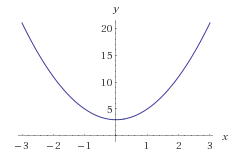

# JavaScript Funcionalmente-Ligero
# Capítulo 2: La Naturaleza De Las Funciones

La programación funcional **no es solo programar usando la palabra clave `function`.** ¡Oh, si tan solo fuera así de fácil, podría terminar el libro aquí mismo! Sin embargo, las funciones realmente *son* el centro de la PF. Y el cómo usamos a nuestras funciones es lo que hace que nuestro código sea *funcional*.

Pero, ¿qué tan seguro estás de que sabes qué es lo que una *función* realmente signifca?

En este capítulo, vamos a sentar las bases para el resto del libro explorando todos los aspectos fundamentales de las funciones. En realidad, esta es una revisión de todas las cosas que incluso un programador que no sepa de PF deberia saber acerca las funciones. Pero ciertamente, si queremos sacar el máximo provecho de los conceptos de la PF, es esencial que *conozcamos* las funciones desde adentro hacia fuera.

Prepárate, porque hay mucho más en la función de lo que te has dado cuenta.

## ¿Qué es una función?

En su superficie, la pregunta, "¿Qué es una función?", Parece tener una respuesta obvia: una función es una colección de código que se puede ejecutar una o más veces.

Si bien esta es una definición razonable, le falta una esencia muy importante que seria el núcleo de una *función* dentro de la PF. Así que vamos a excavar debajo de la superficie para entender a las funciones más completamente.

### Breve Repaso Matematico

Sé que he prometido que nos mantendríamos alejados de las matemáticas tanto como fuera posible, pero ten paciencia conmigo por un momento, ya que rápidamente observaremos algunas cosas fundamentales sobre las funciones y gráficos del álgebra antes de proceder.

¿Recuerdas haber aprendido algo sobre `f(x)` en la escuela? ¿Qué pasa con la ecuación `y = f(x)`?

Digamos que una ecuación se define así: <code>f(x) = 2x<sup>2</sup> + 3 </code>. Qué significa eso? ¿Qué significa graficar esa ecuación? Aquí está el gráfico:



Lo que puedes notar es que para cualquier valor de `x`, digamos` 2`, si lo insertas en la ecuación, obtienes `11`. ¿Sin embargo, qué es `11`? Es el *valor de retorno* de la función `f(x)`, que antes dijimos representa un valor `y`.

En otras palabras, podemos elegir interpretar los valores de entrada y salida como un punto en `(2,11)` en esa curva del gráfico. Y para cada valor de `x` que conectemos, obtenemos otro valor `y` que se empareja con él como una coordenada en un punto. Otro es `(0,3)`, y otro es `(-1,5)`. Pon todos esos puntos juntos, y tienes el gráfico de esa curva parabólica como se muestra arriba.

Entonces, ¿qué tiene esto que ver con la PF?

En matemáticas, una función siempre toma una o mas entradas, y siempre retorna una salida. Un término que escuchará a menudo en la PF es "morfismo"; esta es una forma elegante de describir un conjunto de valores que se correlaciona con otro conjunto de valores, como por ejmplo, las entradas de una función se relacionan con las salidas de esa función.

En matemática algebraica, esas entradas y salidas a menudo se interpretan como componentes de unas coordenadas que se graficarán. En nuestros programas, sin embargo, podemos definir funciones con todo tipo de entradas y salidas, a pesar de que rara vez se interpretarán como una curva visualmente trazada en un gráfico.

### Función vs Procedimiento

Entonces, ¿por qué hablar de matemáticas y gráficos? Porque, en cierto sentido, la programación funcional consiste en ABRAZAR/EMBRACE el uso de funciones como *funciones* en este sentido matemático.

Puede que estes más acostumbrado a pensar en funciones como procedimientos. ¿Cual es la diferencia? Un procedimiento es una colección arbitraria de funcionalidades. Puede tener entradas, puede que no las tenga. Puede tener una salida (un valor de `retorno`), asi como puede que no.

Una función toma entradas y definitivamente siempre tiene un valor de `retorno`.

Si planeas realizar programación funcional, **deberias de usar funciones tanto como te sea posible**, y tratar de evitar procedimientos siempre que sea posible. Todas tus `funciones` deberian tomar valores de entrada y devolver valores de salida.

¿Por qué? La respuesta a esa pregunta tendrá muchos niveles de significado que descubriremos a lo largo de este libro.

## Entrada de Funciones

Hasta ahora, podemos concluir que las funciones deben de esperar una entrada. Pero profundicemos en cómo funcionan las entradas de una función.

A veces escuchas a las personas referirse a estas entradas como "argumentos" y a veces como "parámetros". Entonces, ¿de qué se trata todo eso?

*Argumentos* son los valores que pasas, y *parámetros* son las variables nombradas dentro de la función que recibe esos valores pasados. Ejemplo:

```js
function foo(x,y) {
    // ..
}

var a = 3;

foo( a, a * 2 );
```

`a` y `a * 2` (en realidad, el resultado de `a * 2`, que seria `6`) son los *argumentos* con los que la funcion `foo(..)` es llamada. `x` y `y` son los *parámetros* que reciben estos valores provenientes del argumento (`3` y `6`, respectivamente).

**Nota:** En JavaScript, no es necesario que la cantidad de *argumentos* coincida con la cantidad de *parámetros*. Si pasas más *argumentos* que el numero de *parámetros* declarados para recibirlos, los valores pasarán intactos. Estos valores se pueden acceder de diferentes formas, incluido el objeto de la vieja escuela `argumentos` (en ingles, el objeto `arguments`), del que quizás hayas oído hablar antes. Si pasas menos *argumentos* que el numero de *parámetros* declarados, cada parámetro sin pareja se le tratara como una variable "indefinida" (en ingles, obtendra el valor "undefined"), lo que significa que este parametro estara presente y disponible en el alcance de la función, pero que tendra el valor de `indefinido` ('undefined').

If you pass fewer *arguments* than the declared *parameters*, each **umatched** parameter is treated as an "undefined" variable, meaning it's present and available in the scope of the function, but just starts out with the empty `undefined` value.

### Parámetros Predeterminados

A partir de ES6, los parámetros pueden declarar *valores por defecto*. En el caso en el que el argumento para ese parámetro no sea pasado, o si el valor `undefined` es pasado, la expresión de asignación predeterminada determinara como se sustituye.

Considera:

```js
function foo(x = 3) {
    console.log( x );
}

foo();                  // 3
foo( undefined );       // 3
foo( null );            // null
foo( 0 );               // 0
```

Siempre es una buena práctica pensar en cualquier caso predeterminado que pueda ayudar a la usabilidad de tus funciones. Sin embargo, los parámetros Predeterminados pueden crear una mayor complejidad en términos de lectura y comprensión en las variaciones de cómo se llama una función. Se prudente en cuanto dependes de esta característica.

### Contando Entradas

El número de argumentos que una función "espera" -- cuántos argumentos probablemente quieras pasarle a esa funcion -- está determinado por la cantidad de parámetros que se declaren.

```js
function foo(x,y,z) {
    // ..
}
```

`foo (..)` *espera* tres argumentos, porque tiene tres parámetros declarados. Este conteo tiene un término especial: aridad. La aridad es la cantidad de parámetros en la declaración de una función. La aridad de `foo (..)` es `3`.

Además, una función con una aridad de 1 también se le llama "unaria", una función con aridad de 2 también se le llama "binaria", y una función con una aridad de 3 o superior se le denomina "n-aria".

Es posible que desees inspeccionar la referencia a una función durante el tiempo de ejecución de un programa para determinar su aridad. Esto se puede hacer con la propiedad `length` de esa referencia a la función:

```js
function foo(x,y,z) {
    // ..
}

foo.length;             // 3
```

Una razón para determinar la aridad durante la ejecución de un programa sería si un fragmento de código recibiera una referencia a una función desde de múltiples fuentes y enviara diferentes valores dependiendo de la aridad de cada una.

Por ejemplo, imagina un caso en el que la referencia a una función `fn` podría esperar uno, dos o tres argumentos, pero siempre deseas pasar una variable `x` en la última posición:

```js
// `fn` solo es una referencia a una funcion
// `x` ya existe con algun valor

if (fn.length == 1) {
    fn( x );
}
else if (fn.length == 2) {
    fn( undefined, x );
}
else if (fn.length == 3) {
    fn( undefined, undefined, x );
}
```

**Consejo:** La propiedad `length` de una función es solo de lectura y se determina en el momento en el que se declara la función. Se deberia pensar que esta es esencialmente una pieza de informacion autoreferencial que describe algo sobre el uso intendido de esa función.

Una advertencia a tener en cuenta es que hay ciertos tipos de variaciones en la lista de parámetros pueden hacer que la propiedad `length` de la función reporte algo diferente de lo que uno podría de esperar:

```js
function foo(x,y = 2) {
    // ..
}

function bar(x,...args) {
    // ..
}

function baz( {a,b} ) {
    // ..
}

foo.length;             // 1
bar.length;             // 1
baz.length;             // 1
```

¿Qué hay acerca de contar la cantidad de argumentos que recibió la función llamada actualmente? Esto solía ser algo trivial, pero la situación ahora es un poco más complicada. Cada función tiene un objeto `arguments` (similar a un array) disponible que contiene una referencia a cada uno de los argumentos pasados. Puedes entonces inspeccionar la propiedad `length` de `arguments` para averiguar cuántos argumentos fueron pasados realmente:

```js
function foo(x,y,z) {
    console.log( arguments.length );
}

foo( 3, 4 );    // 2
```

A partir de ES5 (en el modo estricto, específicamente), el objeto `arguments` es considerado obsoleto; muchos evitan usarlo tanto como sea posible. En JS, "nunca" rompemos la compatibilidad hacia atrás sin importar qué tan útil esto pueda ser para el progreso en el futuro, por lo que `arguments` nunca sera eliminado. Pero ahora se sugiere comúnmente que evites usarlo siempre que sea posible.

Sin embargo, sugiero que `arguments.length`, y solo eso, está bien seguir utilizándolo solo en aquellos casos en los que necesites preocuparte por el número de argumentos pasados. Una versión futura de JS posiblemente podría agregar una función que ofrezca la posibilidad de determinar el número de argumentos pasados ​​sin tener que consultar `arguments.length`; si eso sucede, entonces podemos descartar completamente el uso de `arguments`!

Se cuidadoso: **nunca** accedas a los argumentos posicionalmente, tal como `arguments[1]`. Limitate a `arguments.length` solamente, y solo si debes hacerlo.

Excepto... ¿cómo accederas a un argumento que fue pasado en una posición más allá de los parámetros declarados? Voy a responder a esa pregunta en un momento; pero primero, da un paso atrás y preguntate: "¿Por qué querría hacer algo como eso?". Seriamente. Piensa en eso de cerca durante un minuto.

Debería ser bastante raro que esto ocurra; no deberia ser algo que regularmente esperes o en lo que confíes al escribir tus funciones. Si te encuentras en un escenario así, intenta pasar unos 20 minutos adicionales tratando de diseñar la interacción con esa función de una manera diferente. Nombra ese argumento adicional incluso si es excepcional.

Si la firma de una función acepta una cantidad indeterminada de argumentos, a esta se la denomina función variadica. Algunas personas prefieren este estilo cuando diseñan sus funciones, pero yo creo que encontrarás que a menudo el Programador Funcional prefiere evitar esto cuando sea posible.

De acuerdo, suficiente con insistir en ese punto.

Supongamos que necesitas acceder a los argumentos en una manera posicional (como lo harias en un array), posiblemente porque estarias intentando acceder a un argumento que no tiene un parámetro formal en esa posición. ¿Cómo lo hacemos?

ES6 al rescate! Vamos a declarar nuestra función con el operador `...` - conocido como "spread", "rest", o (mi preferencia) "reunir".

```js
function foo(x,y,z,...args) {
    // ..
}
```

Ves el `...args` en la lista de los parámetros? Esta es una forma declarativa proveniente de ES6 que le dice al motor de JS que recolecte (ejem, "reúna") todos los argumentos restantes (si los hay) no asignados a los parámetros nombrados, y los coloca en una array con el nombre de `args`. `args` siempre será un array, incluso si está vacío. Pero **no** incluirá los valores que ya están asignados a los parámetros `x`,` y`, `z`, solo cualquier otros valores que esten más allá de esos tres primeros valores.

```js
function foo(x,y,z,...args) {
    console.log( x, y, z, args );
}

foo();                  // undefined undefined undefined []
foo( 1, 2, 3 );         // 1 2 3 []
foo( 1, 2, 3, 4 );      // 1 2 3 [ 4 ]
foo( 1, 2, 3, 4, 5 );   // 1 2 3 [ 4, 5 ]
```

Entonces, si *realmente* deseas diseñar una función que pueda recibir una cantidad arbitraria de argumentos para que sean pasados, usa `...args` (o el nombre que desees) al final. Ahora, tendras un array real, no obsoleto y no apestoso, para acceder a esos valores del argumento.

Solo presta atención al hecho de que el valor `4` está en la posición `0` de ese `args`, no en la posición` 3`. Y que su valor `length` no incluirá esos tres valores `1`, `2` y `3`. `...args` reúne todo lo demás, sin incluir `x`, `y`, y `z`.

Incluso *puedes* utilizar el operador `...` en la lista de parámetros si no hay otros parámetros formales declarados:

```js
function foo(...args) {
    // ..
}
```

Ahora `args` será el array completo de los argumentos, sean lo que sean, y puedes usar `args.length` para saber exactamente cuántos argumentos han sido pasados. Y eres libre de usar `args[1]` o `args[317]` si así lo deseas. Sin embargo, no pases 318 argumentos, por favor.

### Arrays De Argumentos

¿Qué pasaría si quisieras pasar un array de valores como los argumentos en la llamada de una función?

```js
function foo(...args) {
    console.log( args[3] );
}

var arr = [ 1, 2, 3, 4, 5 ];

foo( ...arr );                      // 4
```

Nuestro nuevo amigo `...` es usado, pero ahora no solo en la lista de parámetros; también es usado en la lista de argumentos en el sitio donde la funcion es llamada. Tiene el comportamiento opuesto en este contexto. En una lista de parámetros, dijimos que *reunió* a los argumentos. En una lista de argumentos, los *extiende*. Por lo tanto, los contenidos de `arr` se extienden en realidad como argumentos individuales en la llamada a `foo (..)`. ¿Ves cual es la diferencia a solo pasar una referencia a todo el array `arr`?

Por cierto, valores múltiples y las separaciones `...` pueden ser intercaladas, como mejor te parezca:

```js
var arr = [ 2 ];

foo( 1, ...arr, 3, ...[4,5] );      // 4
```

Piensa en `...` en este sentido simétrico: en una posición de lista de valores, se *extienden*. En una posición de asignación, como en una lista de parámetros, porque los argumentos se *asignan a* parámetros, los *reúne*.

Cualquiera sea el comportamiento que invoques, `...` hace que trabajar con arrays de argumentos sea mucho más fácil. Ya pasaron los días de `slice(..)`, `concat(..)` y `apply(..)` para controlar nuestros arrays de valores de argumentos.

**Consejo:** En realidad, estos métodos no son del todo inútiles. Habrá algunos lugares en los que confiaremos en ellos a lo largo del código de este libro. Pero sin duda, en la mayoría de los lugares, `...` será mucho más declarativamente legible y, como resultado, preferible a los metodos mencionados.

### Destructuración de parámetros

Considera la variadica `foo (..)` en la sección anterior:

```js
function foo(...args) {
    // ..
}

foo( ...[1,2,3] );
```

¿Qué pasaría si quisiéramos cambiar esa interacción, para que la persona que llama a nuestra funcion pase un array de valores en lugar de valores como argumentos individuales? Simplemente deja de usar los dos `...`:

```js
function foo(args) {
    // ..
}

foo( [1,2,3] );
```

Suficientemente simple. Pero, ¿y si ahora quisiéramos dar un nombre de parámetro a cada uno de los dos primeros valores pasados en el array? Ya no estamos declarando parámetros individuales, así que parece que perdimos esa habilidad.

Afortunadamente, la desestructuración en ES6 es la respuesta. La desestructuración es una forma de declarar un *patrón* para el tipo de estructura (objeto, array, etc.) que esperas ver, y cómo debe de procesarse la descomposición (asignación) de sus partes individuales.

Considera:

```js
function foo( [x,y,...args] = [] ) {
    // ..
}

foo( [1,2,3] );
```

¿Ves los corchetes `[ .. ]` alrededor de la lista de parámetros ahora? Esto se llama desestructuración de parámetros en arrays.

En este ejemplo, la desestructuración le dice al motor de JS que espere un array en esta posición de asignación (en otras palabras, en este parametro). El patrón dice que tome el primer valor de ese conjunto y lo asigne a una variable de parámetro local llamada `x`, el segundo a `y`, y los valores restantes, que se *reunan* en `args`.

### La importancia Del Estilo Declarativo

Teniendo en cuenta el `foo(..)` desestructurado que acabamos de ver, podríamos haber procesado los parámetros manualmente:

```js
function foo(parametros) {
    var x = parametros[0];
    var y = parametros[1];
    var args = parametros.slice( 2 );

    // ..
}
```

Pero aquí destacamos un principio que presentamos brevemente en el Capítulo 1: el código declarativo comunica de una manera más efectiva que el código imperativo.

El código declarativo -- por ejemplo, la desestructuración en el antiguo fragmento `foo(..)` o los usos del operador `...` -- se centra en cuál debe ser el resultado en una pieza de código.

El código imperativo -- como las asignaciones manuales en el último fragmento -- se centra más en cómo obtener el resultado. Si luego lees código imperativo como ese, debes ejecutarlo mentalmente para comprender cual es el resultado deseado. El resultado está *codificado* allí, pero no está tan claro porque está nublado por los detalles de *cómo* llegamos allí.

El primer `foo(..)` se considera más legible, porque la desestructuración oculta los detalles innecesarios de *cómo* gestionar las entradas de los parámetros; el lector es libre de enfocarse solo en el *qué* haremos con esos parámetros. Esa es claramente la preocupación más importante, ya que eso es en lo que el lector debería centrarse para comprender el código más completamente.

Siempre que sea posible, y al grado en el que nuestro lenguaje y nuestras librerias/frameworks nos lo permitan, **debemos esforzarnos por escribir código declarativo y autoexplicativo.**

## Argumentos Nombrados

Del mismo modo en el que podemos desestructurar los parámetros de arrays, podemos desestructurar los parámetros de objetos:

```js
function foo( {x,y} = {} ) {
    console.log( x, y );
}

foo( {
    y: 3
} );                    // undefined 3
```

Pasamos un objeto como único argumento, y se desestructura en dos variables de parámetros separadas `x` y `y`, a las que se les asignan los valores de esos nombres con las propiedades correspondientes del objeto pasado. No importo que la la propiedad `x` no estuviera en el objeto; simplemente terminó como una variable con el valor de `undefined` tal y como era de esperar.

Pero la parte en desestructuración de objetos de parámetros a la que quiero que le prestes atención es al objeto que esta siendo pasado a `foo(..)`.

Con una invocacion de funcion normal como `foo(undefined, 3)`, las posiciones se usan para mapear los argumentos a los parámetros; ponemos el `3` en la segunda posición para asignarlo al parámetro `y`. Pero con este nuevo tipo de invocacion de funciones donde la desestructuración de parámetros esta involucrada, una simple propiedad de objeto indica a qué parámetro (`y`) se le debe de asignar el valor de argumento `3`.

No tuvimos que preocuparnos por `x` en *esa* invocacion a la funcion porque en realidad no nos importaba `x`. Simplemente lo omitimos, en lugar de tener que hacer algo que nos distrayera tal y como pasar `undefined` como un marcador de posicion.

Algunos lenguajes tienen una característica explícita para esto: argumentos nombrados. En otras palabras, en el sitio de la llamada a la funcion, se etiqueta un valor de entrada para indicar a qué parámetro sera asignado. JavaScript no tiene argumentos nombrados, pero la desestructuración de los objetos de parámetro es la mejor alternativa.

Otro beneficio relacionado con la PF es que utilizar la desestructuración de objetos para pasar argumentos potencialmente múltiples es que una función que solo toma un parámetro (el objeto) es mucho más fácil de componer con la salida única de otra función. Mucho más sobre eso en el Capítulo 4.

### Parámetros No Ordenados

Otro beneficio clave es que los argumentos nombrados, en virtud de ser especificados como propiedades del objeto, no están fundamentalmente ordenados. Eso significa que podemos especificar entradas en el orden que queramos:

```js
function foo( {x,y} = {} ) {
    console.log( x, y );
}

foo( {
    y: 3
} );                    // undefined 3
```

Estamos omitiendo el parámetro `x` simplemente omitiéndolo. O podríamos especificar un argumento `x` si asi quisieramos, incluso si lo enumeráramos después de `y` en la definicion del objeto. La invocacion a la funcion ya no se tiene que preocupar por marcadores de posición ordenados tales como `undefined` solo para omitir un parámetro.

Los argumentos nombrados son mucho más flexibles y atractivos desde una perspectiva de legibilidad, especialmente cuando la función en cuestión puede tomar 3, 4 o más entradas.

**Sugerencia:** Si este estilo de argumentos de función te parece útil o interesante, consulta la cobertura de mi biblioteca "FPO" en el Apéndice C.

## Salida de Funciones

Cambiemos nuestra atención de las entradas de una función a su salida.

En JavaScript, las funciones siempre devuelven un valor. Estas tres funciones tienen un comportamiento idéntico de `devolucion` (`return` en ingles):

```js
function foo() {}

function bar() {
    return;
}

function baz() {
    return undefined;
}
```

El valor `undefined` es implícitamente `retornado` si la funcion no tiene un valor de `return` explicito o si solo tiene un `return;` vacío.

Pero manteniendo tanto como sea posible el espíritu de la definición de como deben de ser las funciónes en PF -- usando funciones y no procedimientos -- nuestras funciones siempre deben de tener salidas, lo que significa que deben `devolver` explícitamente un valor, y generalmente ese valor no deberia de ser `undefined`.

Una declaración de `return` solo puede devolver un solo valor. Entonces, si tu función necesita devolver múltiples valores, la única opción viable es juntarlos en un valor compuesto como un array o un objeto:

```js
function foo() {
    var valorRetornado1 = 11;
    var valorRetornado2 = 31;
    return [ valorRetornado1, valorRetornado2 ];
}
```

Luego, asignamos `x` y `y` de los dos elementos provenientes del array retornado por `foo()`:

```js
var [ x, y ] = foo();
console.log( x + y );           // 42
```

Recopilar valores múltiples en un array (u objeto) para que sean retornados, y posteriormente desestructurar esos valores nuevamente en asignaciones distintas, es una forma de expresar de forma transparente varias salidas para una función.

**Consejo:** Sería negligente si no te sugiriera que te tomes un momento para considerar si una función que necesita múltiples salidas podría ser refactorizada para evitar eso, ¿tal vez separar esa funcion en dos o más funciones más pequeñas con un propósito único? A veces eso será posible, a veces no; pero al menos deberías considerarlo.

### Returns Tempranos

La declaración `return` no solo devuelve un valor de una función. También es una estructura de control de flujo; termina la ejecución de la función en ese punto. Una función con múltiples declaraciones `return` tiene múltiples puntos de salida posibles, lo que significa que puede ser más difícil de leer una función para comprender su comportamiento de salida si hay muchas rutas que podrían producir esa salida.

Considera:

```js
function foo(x) {
    if (x > 10) return x + 1;

    var y = x / 2;

    if (y > 3) {
        if (x % 2 == 0) return x;
    }

    if (y > 1) return y;

    return x;
}
```

Examen sorpresa: sin hacer trampa y ejecutar este código en tu navegador, ¿qué valor es retornado por `foo(2)`? ¿Qué pasa con `foo(4)`? Y `foo(8)`? Y `foo(12)`?

¿Qué tan seguro estás de tus respuestas? ¿De cuánto fue el impuesto mental que pagaste para obtener esas respuestas? Yo me equivoqué las primeras dos veces que traté de resolverlo, ¡y lo escribí!

Creo que parte del problema de legibilidad es que estamos utilizando `return` no solo para devolver valores diferentes, sino que también lo estamos utilizando para controlar el flujo de nuestro programa para salir de la ejecución de la función de una manera temprana en ciertos casos. Obviamente hay mejores formas de escribir ese control de flujo (la lógica `if`, etc.), pero también creo que hay formas de hacer que las rutas de salida sean más obvias.

**Nota:** Las respuestas al cuestionario son `2`, `2`, `8` y `13`.

Considere esta versión del código:


```js
function foo(x) {
    var valorRetornado;

    if (valorRetornado == undefined && x > 10) {
        valorRetornado = x + 1;
    }

    var y = x / 2;

    if (y > 3) {
        if (valorRetornado == undefined && x % 2 == 0) {
            valorRetornado = x;
        }
    }

    if (valorRetornado == undefined && y > 1) {
        valorRetornado = y;
    }

    if (valorRetornado == undefined) {
        valorRetornado = x;
    }

    return valorRetornado;
}
```

Esta versión es indudablemente más larga. Pero yo diría que es una lógica un poco más simple de seguir, porque en cada rama donde a `valorRetornado` se le puede asignar un valor es *protegida* por la condición que verifica si la variable de `valorRetornado` ya tiene un valor asignado.

En lugar de `regresar` de la función tempranamente, usamos el control de flujo normal (lógica `if`) para determinar la asignación de `valorRetornado`. Al final, simplemente escribimos `return valorRetornado`.

No estoy diciendo incondicionalmente que siempre debes de tener un solo `return`, o que nunca debes hacer un `retorno` temprano, pero sí creo que debes de tener cuidado con la parte de control de flujo de `return` que crea algo mas de confusion en las definiciones de funciones. Intenta descubrir la forma más explícita de expresar la lógica de tu programa; a menudo esa será la mejor manera.

### Salidas sin ser `retorn`adas

Una técnica que probablemente hayas usado en la mayoría del código que has escrito, y tal vez ni siquiera lo hayas pensado demasiado, es hacer que una función genere algunos o todos sus valores simplemente cambiando variables fuera de sí misma.

¿Recuerdas nuestra función de <code>f(x) = 2x<sup>2</sup> + 3</code> de antes en este capítulo? Podríamos haberlo definido así en JS:

```js
var y;

function foo(x) {
    y = (2 * Math.pow( x, 2 )) + 3;
}

foo( 2 );

y;                      // 11
```

Sé que este es un ejemplo tonto; podríamos simplemente 'devolver' el valor en lugar de asignarselo a `y` desde dentro de la función:

```js
function foo(x) {
    return (2 * Math.pow( x, 2 )) + 3;
}

var y = foo( 2 );

y;                      // 11
```

Ambas funciones realizan la misma tarea. ¿Hay alguna razón por la que deberiamos elegir una sobre la otra? **Si, absolutamente.**

Una forma de explicar la diferencia es que el `retorno` en la segunda versión indica una salida explícita, mientras que la asignación a `y` en la primera funcion es una salida implícita. Es posible que ya tengas una intuición que te guíe en tales casos; típicamente, los programadores prefieren patrones explícitos sobre los implícitos.

Pero cambiar una variable en un ámbito externo, como lo hicimos con la asignación de `y` dentro de `foo(..) `, es solo una forma de lograr un resultado implícito. Un ejemplo más sutil es hacer cambios a valores no locales a través de referencias.

Considera:

```js
function suma(lista) {
    var total = 0;
    for (let i = 0; i < lista.length; i++) {
        if (!lista[i]) lista[i] = 0;

        total = total + lista[i];
    }

    return total;
}

var numeros = [ 1, 3, 9, 27, , 84 ];

suma( numeros );            // 124
```

El resultado más obvio de esta función es la suma `124`, que explícitamente `devolvemos`. Pero, ¿te diste cuenta de la otra salida? Prueba el código y luego inspecciona el array `numeros`. Ves ahora la diferencia?

En lugar de un valor de `undefined` en la ranura vacía en la posición `4`, ahora hay un `0`. La operación inofensiva de `lista[i] = 0` terminó afectando el valor del array en el exterior, aunque operamos en una variable de parámetro `lista` local.

¿Por qué? Porque `lista` es una copia-de-referencia a la referencia de `numeros`, no una copia-de-valor del valor del `[1,3,9, ..]`. JavaScript utiliza referencias y copias-de-referencia para arrays, objetos y funciones, por lo que podemos crear una salida accidental desde nuestra función con demasiada facilidad.

Esta salida de función implícita tiene un nombre especial en el mundo de la PF: efectos secundarios. Y una función que *no tiene efectos secundarios* también tiene un nombre especial: función pura. Hablaremos mucho más sobre esto en el Capítulo 5, pero la conclusion principal es que queremos preferir a las funciones puras y evitar los efectos secundarios en nuestro codigo siempre que sea posible.

## Funciones De Funciones

Las funciones pueden recibir y devolver valores de cualquier tipo. Una función que recibe o devuelve uno o más valores de función tiene el nombre especial: función de orden superior.

Considera:

```js
function forEach(lista,funcion) {
    for (let v of lista) {
        funcion( v );
    }
}

forEach( [1,2,3,4,5], function cada(valor){
    console.log( valor );
} );
// 1 2 3 4 5
```

`forEach (..)` es una función de orden superior porque recibe una función como argumento.

Una función de orden superior también puede generar otra función, como:

```js
function foo() {
    return function interna(mensaje){
        return mensaje.toUpperCase();
    };
}

var f = foo();

f( "Hola!" );          // HOLA!
```

`return` no es la única forma de "generar" una función interna:

```js
function foo() {
    bar( function interna(mensaje){
        return mensaje.toUpperCase();
    } );
}

function bar(funcion) {
    funcion( "Hola!" );
}

foo();                  // HOLA!
```

Las funciones que tratan otras funciones como valores son funciones de orden superior por definición. ¡Los Programadores Funcionales las escriben todo el tiempo!

### Manteniendo el alcance

Una de las cosas más poderosas en toda la programación, y especialmente en la PF, es cómo se comporta una función cuando está dentro del alcance de otra función. Cuando la función interna hace referencia a una variable de la función externa, esto se llama cierre.

Definido pragmáticamente:

> Cierre es cuando una función recuerda y accede a las variables desde fuera de su propio alcance, incluso cuando esa función se ejecuta en un alcance diferente.

Considera:

```js
function foo(mensaje) {
    var funcion = function interna(){
        return mensaje.toUpperCase();
    };

    return funcion;
}

var funcionHola = foo( "Hola!" );

funcionHola();              // HOLA!
```

La variable de parámetro `mensaje` en el alcance de `foo(..)` es referenciada dentro de la función interna. Cuando `foo(..)` es ejecutada y la función interna es creada, esta captura el acceso a la variable `mensaje`, y retiene ese acceso incluso después de ser `retornada`.

Una vez que tenemos a `funcionHola`, una referencia a la función interna, `foo(..)` ha terminado y parecería que su alcance debería haber desaparecido, lo que significa que la variable `mensaje` ya no existe. Pero eso no sucede, porque la función interna tiene un cierre sobre `mensaje` que mantiene a la variable viva. La variable cerrada `mensaje` sobrevive tanto tiempo como la función interna (ahora referenciada por `funcionHola` en un alcance diferente) se mantenga.

Veamos algunos ejemplos más de cierre en acción:

```js
function persona(nombre) {
    return function identificar(){
        console.log( `Yo soy ${nombre}` );
    };
}

var fred = persona( "Fred" );
var susan = persona( "Susan" );

fred();                 // Yo soy Fred
susan();                // Yo soy Susan
```

La función interna `identificar()` tiene un cierre sobre el parámetro `nombre`.

El acceso que permite el cierre no solo se limita a leer el valor original de la variable -- no es solo una instantánea de la variable, sino mas como un enlace vivo. Puedes actualizar el valor, y ese nuevo estado actual permanece guardado hasta el siguiente acceso.

```js
function corriendoContador(comienzo) {
    var valor = comienzo;

    return function actual(incremento = 1){
        valor = valor + incremento;
        return valor;
    };
}

var puntuacion = corriendoContador( 0 );

puntuacion();                // 1
puntuacion();                // 2
puntuacion( 13 );            // 15
```

**Advertencia:** Por razones que trataremos más adelante en el libro, este ejemplo de usar un cierre para recordar un estado que cambia (`valor`) probablemente sea algo que querrás evitar siempre que sea posible.

Si tienes una operación que necesita dos entradas, una de las cuales conoces ahora, pero la otra sera especificada más adelante, puedes usar un cierre para recordar la primera entrada:

```js
function crearSumador(x) {
    return function suma(y){
        return x + y;
    };
}

// ya conocemos `10` y `37` como las primeras entradas, respectivamente
var sumarleA10 = crearSumador( 10 );
var sumarleA37 = crearSumador( 37 );

// más tarde, especificamos las segundas entradas
sumarleA10( 3 );           // 13
sumarleA10( 90 );          // 100

sumarleA37( 13 );          // 50
```

Normalmente, una función `suma(..)` tomaría como entradas `x` y `y` para sumarlas. Pero en este ejemplo, recibimos y recordamos (a través del cierre) los valores de `x` primero, mientras que los valores `y` se especifican por separado más adelante.

**Nota:** Esta técnica de especificar entradas en llamadas sucesivas a funciones es muy común en Pf, y se presenta en dos formas: aplicación parcial y "currying". Nos sumergiremos más a fondo en ellas luego en el texto.

Por supuesto, dado que las funciones son solo valores en JS, podemos recordar los valores de funciones haciendo uso del cierre.


```js
function formateador(formatearFuncion) {
    return function interna(texto){
        return formatearFuncion( texto );
    };
}

var minuscula = formateador( function formateando(valor){
    return valor.toLowerCase();
} );

var mayusculaPrimero = formateador( function formateando(valor){
    return valor[0].toUpperCase() + valor.substr( 1 ).toLowerCase();
} );

minuscula( "WOW" );             // wow
mayusculaPrimero( "hola" );      // Hola
```

En lugar de distribuir/repetir la lógica de `toUpperCase()` y `toLowerCase()` en todo nuestro código, la PF nos alienta a crear funciones simples que encapsulen -- una forma elegante de decir envolver -- ese comportamiento.

Específicamente, creamos dos funciones simples simples `minuscula(..)` y `mayusculaPrimero(..)`, porque esas funciones serán mucho más fáciles de crear para trabajar con otras funciones en el resto de nuestro programa.

**Consejo:** Te diste cuenta de cómo `mayusculaPrimero(..)` podría haber usado `minuscula(..)`?

Utilizaremos cierres en gran medida durante el resto del texto. Simplemente puede ser la práctica fundacional más importante en toda la PF, si no lo es en la programación como un todo. ¡Asegúrate de estar realmente cómodo con el cierre!

## Sintaxis

Antes de pasar de este manual sobre funciones, tomemos un momento para discutir su sintaxis.

Más que en muchas otras partes de este texto, las discusiones en esta sección son en su mayoría opiniones y preferencias, ya sea que estes de acuerdo con las opiniones presentadas aquí o tomes las opiniones opuestas. Estas ideas son altamente subjetivas, aunque muchas personas parecen sentirse bastante objetivos acerca de ellas.

Al final, tu decides.

### ¿Que hay en un nombre?

Desde un punto de vista sintáctico, las declaraciones de funciones requieren la inclusión de un nombre:

```js
function holaMiNombreEs() {
    // ..
}
```

Pero las expresiones de función pueden venir en ya sea como funciones nombradas o como funciones anónimas:

```js
foo( function expresionDeFuncionNombrada(){
    // ..
} );

bar( function(){    // <-- mira, no hay nombre!
    // ..
} );
```

¿A qué nos referimos exactamente por anónimas, por cierto? Específicamente, las funciones tienen una propiedad `name` (nombre) que contiene el valor del nombre que la función recibió sintácticamente, como `"holaMiNombreEs"` o `"expresionDeFuncionNombrada"`. Esta propiedad `name` es utilizada principalmente por las herramientas de desarrollador/consola en tu entorno de JS para señalar a la función cuando esta participa en un "stack trace" (generalmente a partir de una excepción).

Las funciones anónimas generalmente se muestran como `(anonymous function)` (`(función anónima)` en español).

Si alguna vez has tenido que depurar un programa de JS con nada más que con un rastro de excepción (un "stack trace" en ingles), probablemente hayas sentido el dolor de ver `(anonymous function)` aparecer línea tras línea. Este error no le proporciona al desarrollador ninguna pista acerca de donde proviene la excepción. No le esta haciendo ningun favor al desarrollador.

Si nombra a tus expresiones de función, el nombre de la funcion siempre es usado. Entonces, si usas un buen nombre como `manejarClicksDePerfil` en lugar de `foo`, obtendrás "stack traces" muchos más útiles.

A partir de ES6, las expresiones de funciones anónimas son en algunos casos ayudadas por algo llamado *inferencia de nombres*. Considera:

```js
var x = function(){};

x.name;         // x
```

Si el motor es capaz de adivinar qué nombre *probablemente* quieres que tome la función, continuará y lo hará.

Pero ten cuidado, no todas las formas sintácticas se benefician de la inferencia de nombres. Probablemente, el lugar más común que muestra una expresión de función es como un argumento para una llamar a una función:

```js
function foo(funcion) {
    console.log( funcion.name );
}

var x = function(){};

foo( x );               // x
foo( function(){} );    //
```

Cuando el nombre no puede inferirse de la sintaxis inmediata que lo rodea, el nombre de la funcion permanece como un valor vacio. Dicha función sera reportada como `(anonymous function)` en un "stack trace" si se llega a producir alguno.

Hay otros beneficios para ponerle nombre a una función aparte del asunto de la depuración. En primer lugar, el nombre sintáctico (también conocido como nombre léxico) es útil para la autorreferencia interna. Las autorreferencias son necesarias para hacer uso de la recursión (tanto sincronica como asincrónico) y también es útil con los manejadores de eventos.

Considera estos diferentes escenarios:

```js
// recursion sincronica:
function encontrarPropiedadEn(nombreDePropiedad,objeto) {
    if (objeto == undefined || typeof objeto != "object") return;

    if (nombreDePropiedad in objeto) {
        return objeto[nombreDePropiedad];
    }
    else {
        for (let propiedad of Object.keys( objeto )) {
            let valorRetornado = encontrarPropiedadEn( nombreDePropiedad, objeto[propiedad] );
            if (valorRetornado !== undefined) {
                return valorRetornado;
            }
        }
    }
}
```

```js
// recursion asincrónico:
setTimeout( function esperalo(){
    // `eso` existe ya?
    if (!o.eso) {
        // intentalo nuevamente despues
        setTimeout( esperalo, 100 );
    }
}, 100 );
```

```js
// desvinculación de manejador de evento
document.getElementById( "botonUno" )
    .addEventListener( "click", function manejarClick(evento){
        // desvincular evento
        evento.target.removeEventListener( "click", manejarClick, false );

        // ..
    }, false );
```

En todos estos casos, el nombre léxico de la función nombrada era una autorreferencia útil y confiable desde su interior.

Además, incluso en casos simples con funciones de una sola línea, nombrarlas tiende a hacer que el código sea más fácil de entender y, por lo tanto, más fácil de leer para quienes no lo hayan leído antes:

```js
gente.map( function obtenerNombrePreferido(persona){
    return persona.apodos[0] || persona.primerNombre;
} )
// ..
```

El nombre de la función `obtenerNombrePreferido(..)` le dice al lector algo acerca de lo que la operación de mapeo intenta hacer y que no es del todo obvio solo por su código. Esta etiqueta de nombre ayuda a que el código sea más legible.

Otro lugar donde las expresiones de funciones anónimas son comunes es con las EFIIs (expresiones de función invocadas inmediatamente):

```js
(function(){

    // mira, soy una EFII!

})();
```

Virtualmente nunca se ve que las EFIIs usen nombres para sus expresiones de función, pero deberían. ¿Por qué? Por las mismas razones que acabamos de analizar: depuración de un stack trace, autorreferencia confiable y legibilidad. Si no puedes encontrar ningún nombre para tu EFII, al menos usa la palabra EFII:

```js
(function EFII(){

    // Tu ya sabias que yo era una EFII!

})();
```

A lo que me refiero es que hay múltiples razones por las cuales **las funciones nombradas son siempre más preferibles que las funciones anónimas.** De hecho, iría tan lejos como para decir que básicamente nunca hay un caso donde una función anónima sea más preferible. Simplemente no tienen ninguna ventaja sobre sus equivalentes nombrados.

Es increíblemente fácil escribir funciones anónimas, porque es un nombre menos al que le tenemos que dedicar nuestra atención mental para conseguir un nombre correcto.

Seré honesto; Soy tan culpable de esto como cualquiera. No me gusta tener que luchar con nombrar cosas. Los primeros 3 o 4 nombres que se me ocurren para una función suelen ser malos. Tengo que revisitar la accion de nombrar una y otra vez. Prefiero simplemente despuntar una buena y clasica expresión de función anónima.

Pero estamos negociando la facilidad-de-escritura con el dolor-de-lectura. Este no es buen intercambio. Ser flojo o poco creativo como para no querer encontrar nombres para tus funciones es una excusa demasiado común, pero deficiente, para usar funciones anónimas.

**Nombra todas las funciones.** Y si te sientas aturdido, sin poder encontrar un buen nombre para alguna función que hayas escrito, sugiero encarecidamente que todavía no comprendes del todo el propósito de esa función -- o es demasiado amplia o abstracta. Debes volver y rediseñar la función hasta que esto sea más claro. Y en ese punto, el nombre de la funcion será más evidente.

En mi práctica, si no tengo un buen nombre para usar para una función, la llamo `PARAHACER` al principio. Estoy seguro de que al menos la veré más tarde cuando este buscando comentarios "PARAHACER" antes de cometer (commit en ingles) el código.

Puedo afirmar, por mi propia experiencia, que en la lucha por nombrar algo bien, generalmente lo entiendo mejor, más tarde, y con frecuencia incluso refactorizo ​​su diseño para mejorar la legibilidad y la capacidad de mantenimiento.

Esta vez la inversión de tiempo vale la pena.

### Funciones Sin `function`

Hasta ahora hemos estado usando la sintaxis canónica completa para las funciones. Pero sin duda también habras escuchado todos los rumores acerca de la sintaxis de la función de flecha en ES6 `=>`.

Compara:

```js
gente.map( function obtenerNombrePreferido(persona){
    return persona.apodos[0] || persona.primerNombre;
} )
// vs.

gente.map( persona => persona.apodos[0] || persona.primerNombre );
```

Wow.

La palabra clave `function` se ha ido, asi como `return`, los paréntesis `( )`, las llaves `{ }`, y el punto y coma interno `;`. En lugar de todo eso, usamos un símbolo llamado flecha gorda `=>`.

Pero hay otra cosa que omitimos. ¿Lo viste? El nombre de la función `obtenerNombrePreferido`.

Eso está bien; las funciones de flecha `=>` son léxicamente anónimas; no hay forma de proporcionarles un nombre sintácticamente. Sus nombres se pueden inferir como funciones regulares, pero de nuevo, el caso más común de valores de expresión de función pasados ​​como argumentos no recibirá ninguna ayuda de esa manera. Una lastima.

Si `persona.apodos` no está definido por alguna razón, se lanzará una excepción, lo que significa que `(anonymous function)` estará en la parte superior del "stack trace". Ugh.

Honestamente, la anonimato de las funciones de flecha `=>` es una daga `=>` para mi corazón. No puedo soportar la pérdida de nombres. Es más difícil de leer, más difícil de depurar e imposible de autorreferir.

Pero si eso no fuera lo suficientemente malo, la otra bofetada en la cara es que hay un montón de sutiles variaciones sintácticas a las que debes prestarle atencion si tienes diferentes escenarios para la definición de tu función. No los voy a detallar aquí en detalle, sino brevemente:

```js
gente.map( persona => persona.apodos[0] || persona.primerNombre );

// parametros multiples? necesitas ( )
gente.map( (persona,idx) => persona.apodos[0] || persona.primerNombre );

// desestructuracion de parametros? necesitas ( )
gente.map( ({ persona }) => persona.apodos[0] || persona.primerNombre );

// parametro por defecto? necesitas ( )
gente.map( (persona = {}) => persona.apodos[0] || persona.primerNombre );

// retornando un objeto? necesitas ( )
gente.map( persona =>
    ({ preferredName: persona.apodos[0] || persona.primerNombre })
);
```

El caso de emoción sobre `=>` en el mundo de la PF principalmente es que sigue casi exactamente la notación matemática para funciones, especialmente en lenguajes de PF como Haskell. La forma de la sintaxis de la función de flecha `=>` se comunica matemáticamente.

Excavando aún más, sugiero que el argumento a favor de `=>` es que al usar una sintaxis mucho más liviana, reducimos los límites visuales entre las funciones, lo que nos permite usar expresiones de funciones simples como si usáramos expresiones perezosas -- Otro favorito de los Programadores-Funcionales.

Creo que la mayoría de los Programadores-Funcionales van a acallar las preocupaciones que estoy compartiendo. Les encantan las funciones anónimas y aman ahorrar en sintaxis. Pero como dije antes: tú decides.

**Nota:** Aunque prefiero no usar `=>` en la práctica en mi código de producción, son útiles en las exploraciones de código rápido. Además, utilizaremos funciones de flecha en muchos lugares a lo largo del resto de este libro -- especialmente cuando presentamos las utilidades típicas de PF -- donde se prefiere ser conciso para optimizar el espacio físico limitado en los fragmentos de código. Has tus propias determinaciones sobre si este enfoque hará que tu propio código listo para producción sea más o menos legible.

## ¿Qué es esto (this)?

Si no estas familiarizado con las reglas obligatorias de `this` en JavaScript, te recomiendo que consultes mi libro "You Don't Know JS: this & Object Prototypes". Para los propósitos de esta sección, supondré que sabes cómo se determina `this` en una llamada a una función (una de las cuatro reglas). Pero incluso si todavía estás confundido con *this*, la buena noticia es que vamos a concluir en que no deberías usar `this` si estás tratando de hacer PF.

**Nota:** Estamos abordando un tema que en el que finalmente concluiremos que no deberíamos usar. ¿¡Entonces, por qué!? Porque el tema de `this` tiene implicaciones para otros temas tratados más adelante en este libro. Por ejemplo, nuestras nociones de pureza de función se ven afectadas por `this` siendo esencialmente una entrada implícita a una función (ver Capítulo 5). Además, nuestra perspectiva acerca de `this` afecta si elegimos métodos de arrays (`arr.map(..) `) versus utilidades independientes (`map(.., arr)`) (ver Capítulo 9). Comprender `this` es esencial para entender por qué `this` realmente *no* deberia ser parte de tu PF!

Las `funciones` de JavaScript tienen una palabra clave `this` que se enlaza automáticamente por llamada a función. La palabra clave `this` se puede describir de muchas maneras diferentes, pero prefiero decir que proporciona un contexto al objeto donde la función es ejecutada.

`this` es una entrada de parámetro implícita para tu función.

Considera:

```js
function sumar() {
    return this.x + this.y;
}

var contexto = {
    x: 1,
    y: 2
};

sumar.call( contexto );        // 3

contexto.sumar = sumar;
contexto.sumar();              // 3

var suma = sumar.bind( contexto );
suma();                        // 3
```
Por supuesto, si `this` puede ser ingresado a una función implícitamente, el mismo contexto de objeto podría enviarse como un argumento explícito:

```js
function sum(c) {
    return c.x + c.y;
}

var contexto = {
    x: 1,
    y: 2
};

sum( contexto );
```

Más simple. Y este tipo de código será mucho más fácil de tratar en PF. Es mucho más fácil de conectar varias funciones juntas, o usar cualquiera de las otras técnicas de disputa de entrada que veremos en el siguiente capítulo, donde las entradas son siempre explícitas. Hacerlas con entradas implícitas como `this` varía desde incómodo a casi-imposible dependiendo del escenario.

Hay otros trucos que podemos aprovechar en un sistema-basado-en-`this`, como por ejemplo delegación-de-prototipo (cubierto en detalle en el libro "this & Object Prototypes"):


```js
var Auth = {
    autorizar() {
        var credenciales = `${this.nombreDeUsuario}:${this.contraseña}`;
        this.enviar( credenciales, respuesta => {
            if (respuesta.error) this.mostrarError( respuesta.error );
            else this.mostrarExito();
        } );
    },
    enviar(/* .. */) {
        // ..
    }
};

var Login = Object.assign( Object.create( Auth ), {
    hacerLogin(usuario,contraseñaUsuario) {
        this.nombreDeUsuario = usuario;
        this.contraseña = contraseñaUsuario;
        this.autorizar();
    },
    mostrarError(err) {
        // ..
    },
    mostrarExito() {
        // ..
    }
} );

Login.hacerLogin( "fred", "123456" );
```

**Nota:** `Object.assign(..)` es una utilidad de ES6 en adelante para hacer una copia de asignación superficial de propiedades desde uno o más objetos fuente a un único objeto destino: `Object.assign (destino, fuente1, ...)`.

En caso de que tengas problemas para analizar lo que hace este código: tenemos dos objetos separados, `Login` y `Auth`, donde `Login` realiza un prototipo de delegación hacia `Auth`. Mediante la delegación y el uso compartido del contexto `this` implícito, estos dos objetos se componen virtualmente durante la llamada a la función `this.autorizar()`, de modo que las propiedades/métodos en `this` se comparten dinámicamente con la funcion `Auth.autorizar (..)`.

*Este* código no se ajusta a varios principios de la PF por una variedad de razones, pero uno de los obstáculos obvios es el intercambio implícito de `this`. Podríamos ser más explícitos al respecto y mantener el código en un estilo mas amigable para la PF:

```js
// ..

autorizar(contexto) {
    var credenciales = `${contexto.nombreDeUsuario}:${contexto.contraseña}`;
    Auth.enviar( credenciales, function enRespuesta(respuesta){
        if (respuesta.error) contexto.mostrarError( respuesta.error );
        else contexto.mostrarExito();
    } );
}

// ..

hacerLogin(usuario,contraseñaUsuario) {
    Auth.autorizar( {
        nombreDeUsuario: usuario,
        contraseña: contraseñaUsuario
    } );
}

// ..
```

Desde mi punto de vista, el problema no está en utilizar objetos para organizar el comportamiento. Es que estamos tratando de utilizar una entrada implícita en lugar de ser explícitos al respecto. Cuando estoy usando mi sombrero de PF, quiero dejar `this` en el estante.

## Resumen

Las funciones son poderosas.

Pero seamos claros en qué es una función. No es solo una colección de declaraciones/operaciones. Específicamente, una función necesita una o más entradas (¡idealmente, solo una!) y una salida.

Las funciones dentro de otras funciones pueden tener un cierre sobre las variables externas y recordarlas para más adelante. Este es uno de los conceptos más importantes en toda la programación, y una base fundamental de la PF.

Ten cuidado con las funciones anónimas, especialmente las funciones de flecha `=>`. Son convenientes para escribir, pero cambian el costo de autor a lector. La razón por la que estamos estudiando PF aquí es para escribir un código más legible, así que no te apresures a subirte a ese tren.

No uses funciones que dependan de `this`. Simplemente no lo hagas.

Ahora deberías estar desarrollando una perspectiva clara y colorida en tu mente sobre qué significa *función* en la Programación Funcional. Es hora de comenzar a discutir las funciones para que estas interactúen, y en el próximo capítulo te enseñare una variedad de técnicas críticas que necesitarás a lo largo del camino.
