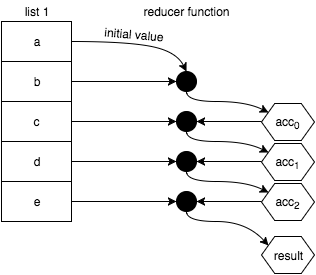
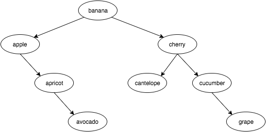

izquierda# JavaScript Funcionalmente-Ligero
# Capítulo 9: Operaciones de Lista

> Si puedes hacer algo de una manera increíble, sigue haciéndolo repetidamente.

Anteriormente ya hemos visto varias referencias breves en el texto a algunas utilidades que ahora queremos examinar muy de cerca, llamadas `map(..)`, `filter(..)`, y `reduce(..)`. En JavaScript, estas utilidades generalmente se utilizan como métodos en el prototipo de array (también conocido como una "lista"), por lo que naturalmente nos referiríamos a ellas como operaciones de arrays o listas.

Antes de hablar sobre los métodos de array específicos, queremos examinar conceptualmente para qué se usan estas operaciones. Es igualmente importante en este capítulo que comprendas *por que* las operaciones de listas son importantes, tanto como que comprendas *cómo* funcionan estas operaciones de listas. Asegúrete de abordar este capítulo con ese detalle en mente.

La gran mayoría de las ilustraciones comunes de estas operaciones, tanto fuera de este libro como aquí en este capítulo, representan tareas triviales realizadas en listas de valores (como duplicar cada número en un array); es una manera barata y fácil de transmitir el mensaje.

Pero no te limites a estos ejemplos simples y te pierdas el punto más profundo. Algo del valor más importante de la Programacion-Funcional-Funcional esta en entender que las operaciones de lista provienen de poder modelar una secuencia de tareas -- una serie de declaraciones que de otra manera *no se verían* como una lista -- como una operación de lista en lugar de realizarlas individualmente.

Esto no es solo un truco para escribir código más conciso. Lo que buscamos es pasar del estilo imperativo al declarativo, para que los patrones de código sean más fácilmente reconocibles y, por lo tanto, más legibles.

Pero hay algo **aún más importante de entender**. Con el código imperativo, cada resultado intermedio en un conjunto de cálculos se almacena en variable(s) a través de la asignación. Cuantos más patrones imperativos tengas en tu código, más difícil de verificar sera que no haya errores -- en la lógica, la mutación accidental de valores o las causas/efectos ocultas se mantienen al acecho.

Al encadenar y/o componer operaciones de listas en conjunto, los resultados intermedios se rastrean implícitamente y en gran medida son protegidos de estos riesgos.

**Nota:** Más que en los capítulos anteriores, para mantener los siguientes fragmentos de código lo más breves posible, confiaremos mucho en el forma `=>` de ES6 . Sin embargo, mi consejo sobre `=>` del Capítulo 2 todavía se aplica a la programacion en general.

## Procesamiento De Listas No-PF

Como un rápido preámbulo de nuestra discusión en este capítulo, deseo mencionar algunas operaciones que pueden parecer relacionadas con los arrays de JavaScript y las operaciones de listas en la Programacion-Funcional, pero que no lo son. Estas operaciones no seran cubiertas aquí, porque no son consistentes con las mejores prácticas generales de la Programacion-Funcional:

* `forEach(..)`
* `some(..)`
* `every(..)`

`forEach(..)` es un asistente de iteración, pero está diseñado para que cada llamada a función funcione con efectos secundarios; ¡probablemente puedas adivinar por qué esa no es una operación de lista respaldada por la Programacion-Funcional para nuestra discusión!

`some(..)` y `every(..)` fomentan el uso de funciones puras (específicamente, funciones predicativas al igual que `filter(..)` lo hace), pero inevitablemente reducen una lista a un resultado de `verdadero`/`falso`, esencialmente como una búsqueda o un pareo. Estas dos utilidades no se ajustan a la forma en que queremos modelar nuestro código con Programacion-Funcional, por lo que vamos a omitir su cobertura aquí.

## Map

Comenzaremos nuestra exploración de las operaciones de lista de la Programacion-Funcional con una de las más básicas y fundamentales: `map(..)`.

Un mapeo es una transformación de un valor a otro. Por ejemplo, si comienzas con el número `2` y lo multiplicas por `3`, lo has mapeado a `6`. Es importante tener en cuenta que no estamos hablando de la transformación de mapeo como una mutación o reasignación *in situ*; en cambio, la transformación de mapeo proyecta un nuevo valor de una ubicación a otra.

En otras palabras:

```js
var x = 2, y;

// transformación / proyección
y = x * 3;

// mutación / reasignación
x = x * 3;
```

Si definimos una función para esta multiplicación por `3`, esa función actúa como una función (transformadora) de mapeo:

```js
var multiplicarPor3 = v => v * 3;

var x = 2, y;

// transformación / proyección
y = multiplicarPor3( x );
```

Naturalmente, podemos extender el mapeo desde una única transformación de valores a una colección de valores. `map(..)` es una operación que transforma todos los valores de una lista a medida que los proyecta a una nueva lista:

<p align="center">
    
</p>

Para implementar `map(..)`:

```js
function map(funcionMapeadora,array) {
    var listaNueva = [];

    for (let [index,v] of array.entries()) {
        listaNueva.push(
            funcionMapeadora( v, index, array )
        );
    }

    return listaNueva;
}
```

**Nota:** El orden de los parámetros `funcionMapeadora, array` puede sentirse al revés al principio, pero esta convención es mucho más común en las bibliotecas de PF porque hace que estas utilidades sean más fáciles de componer (con currying).

A la `funcionMapeadora(..)` se le pasa naturalmente el elemento de la lista para mapear/transformar, pero también un `index` y `array`. Lo estamos haciendo para mantener la coherencia con el `map(..)` ya integrado en array. Estos datos adicionales pueden ser muy útiles en algunos casos.

Pero en otros casos, es posible que desees utilizar una `funcionMapeadora(..)` a la que solo se le debe pasar el elemento de la lista, ya que los argumentos adicionales pueden cambiar su comportamiento. En "Todos Para Uno" del Capítulo 3, presentamos a `unaria(..)`, que limita a una función para aceptar solo un único argumento (sin importar cuántos se pasen).

Recuerde el ejemplo del Capítulo 3 sobre la limitación de `parseInt(..)` a un único argumento para ser utilizado con seguridad como una `funcionMapeadora(..)`:

```js
map( ["1","2","3"], unaria( parseInt ) );
// [1,2,3]
```

JavaScript proporciona la utilidad `map(..)` incorporada en los arrays, por lo que es muy conveniente usarla como parte de una cadena de operaciones en una lista.

**Nota:** Las operaciones del prototipo de array en JavaScript (`map(..)`, `filter(..)`, y `reduce(..)`) aceptan un último argumento opcional para usar para el enlace `this` de la función. Como discutimos en "¿Qué es esto?" en el Capítulo 2, la codificación basada en `this` debería generalmente evitarse siempre que sea posible en términos de coherencia con las mejores prácticas de la Programacion-Funcional. Como tal, nuestras implementaciones de ejemplo en este capítulo no son compatibles con la caracteristica de vincular `this`.

Más allá de las operaciones numéricas o de cadena obvias que podrías realizar en una lista con esos tipos de valores respectivos, aquí hay algunos otros ejemplos de operaciones de mapeo. Podemos usar `map(..)` para transformar una lista de funciones en una lista de sus valores de retorno:

```js
var uno = () => 1;
var dos = () => 2;
var tres = () => 3;

[uno,dos,tres].map( fn => fn() );
// [1,2,3]
```

O podemos primero transformar una lista de funciones al componer cada una de ellas con otra función y luego ejecutarlas:

```js
var incremento = v => ++v;
var decremento = v => --v;
var cuadrado = v => v * v;

var doble = v => v * 2;

[incremento,decremento,cuadrado]
.map( fn => compose( fn, doble ) )
.map( fn => fn( 3 ) );
// [7,5,36]
```

Algo interesante de observar sobre `map(..)`: normalmente asumiríamos que la lista se procesa de izquierda a derecha, pero no hay nada sobre el concepto de `map(..)` que realmente lo requiera. Se supone que cada transformación es independiente de cualquier otra transformación.

El mapeo en un sentido general podría incluso ser paralelizado en un entorno que lo respalde, lo que para una gran lista podría mejorar drásticamente el rendimiento. No vemos que JavaScript realmente lo haga porque no hay nada que requiera que pases una función pura como `funcionMapeadora(..)`, aunque **realmente deberías hacerlo**. Si pasaras una función impura y JS ejecutara llamadas diferentes en diferentes órdenes, causaría estragos rápidamente.

Aunque teóricamente, las operaciones de mapeo individuales son independientes, JS tiene que asumir que no lo son. Eso es un fastidio.

### Sincrónica vs Asincrónica (Sync vs Async)

Las operaciones de lista que estamos discutiendo en este capítulo operan sincrónicamente en una lista de valores que ya están todos presentes; `map(..)` como se concibe aquí es una operación ansiosa. Pero otra forma de pensar acerca de la función del asignador es como un controlador de eventos que se invoca para cada nuevo valor encontrado en la lista.

Imagina algo ficticio como esto:

```js
var nuevoArray = array.map();

array.addEventListener( "valor", multiplicarPor3 );
```

Ahora, cada vez que se agrega un valor a `array`, se llama al manejador de eventos `multiplicarPor3(..)` -- función mapeadora -- con su valor y su transformación se agrega a `nuevoArray`.

Lo que estamos insinuando es que los array y las operaciones de array que realizamos en ellos son las ansiosas versiones sincrónicas, mientras que estas mismas operaciones también se pueden modelar en una "lista diferida" (en otras palabras, una transmisión) que recibe sus valores a lo largo del tiempo. Nos adentraremos a ese tema en el Capítulo 10.

### Mapping vs Eaching

Algunos defienden el uso de `map(..)` como una forma general de iteracion-`forEach (..)`, donde esencialmente el valor recibido se pasa sin ser tocado, pero luego se puede realizar algún efecto secundario:

```js
[1,2,3,4,5]
.map( function funcionMapeadora(v){
    console.log( v );           // efecto secundario!
    return v;
} )
..
```

La razón por la cual esta técnica puede parecer útil es que el `map(..)` devuelve el array para que puedas seguir encadenando más operaciones después de ella; el valor de retorno de `forEach(..)` es `undefined`. Sin embargo, creo que debería evitar el uso de `map(..)` de esta manera, porque es una confusión neta utilizar una basica operación de la PF de una manera decididamente no PF.

Has escuchado la vieja costumbre de usar la herramienta adecuada para el trabajo correcto, ¿verdad? Martillo para clavo, destornillador para tornillo, etc. Esto es ligeramente diferente: se usa la herramienta correcta *de la manera correcta*.

Un martillo debe balancearse en tu mano; si, en cambio, lo sostienes en la boca e intentas martillar el clavo, no serás muy efectivo. `map(..)` está destinado a mapear valores, no a crear efectos secundarios.

### Una Palabra: Functores

En la mayoría de los casos, en este libro intentamos alejarnos de la terminología inventada en la PF. Hemos utilizado términos oficiales a veces, pero mas que todo cuando podemos derivar un sentido de significado de ellos en la conversación cotidiana.

Voy a romper muy brevemente ese patrón y usar una palabra que podría ser un poco intimidante: functor. La razón por la que quiero hablar sobre functores aquí es porque ahora ya entendemos lo que hacen, y porque ese término se usa mucho en el resto de la literatura de la PF; de hecho, los functores son ideas fundamentales en la PF que vienen directamente de los principios matemáticos (teoría de categorías). Al menos estar familiarizado y no asustado por este término será beneficioso.

Un functor es un valor que tiene una utilidad para usar una función de operador en ese valor, que conserva la composición.

Si el valor en cuestión es compuesto, lo que significa que está compuesto de valores individuales, como es el caso de los arrays, por ejemplo! -- un functor usa la función de operador en cada valor individual. Además, la utilidad del functor crea un nuevo valor compuesto que contiene los resultados de todas las llamadas a funciones del operador individual.

Esta es toda una manera elegante de describir lo que acabamos de ver con `map(..)`. La función `map(..)` toma su valor asociado (un array) y una función de mapeo (la función del operador), y ejecuta la función de mapeo para cada valor individual en el array. Finalmente, devuelve un nuevo array con todos los valores recién mapeados.

Otro ejemplo: un functor de string sería una string más una utilidad que ejecuta una función de operador en todos los caracteres del string, devolviendo un nuevo string con las letras procesadas. Considere este ejemplo altamente artificial:

```js
function letraMayuscula(c) {
    var codigo = c.charCodeAt( 0 );

    // letra minuscula?
    if (codigo >= 97 && codigo <= 122) {
        // ponla en mayuscula!
        codigo = codigo - 32;
    }

    return String.fromCharCode( codigo );
}

function stringMap(funcionMapeadora,string) {
    return [...string].map( funcionMapeadora ).join( "" );
}

stringMap( letraMayuscula, "Hola Mundo!" );
// HOLA MUNDO!
```

`stringMap(..)` le permite a un string que sea un functor. Puedes definir una función de mapeo para cualquier estructura de datos; siempre que la utilidad siga estas reglas, la estructura de datos es un functor.

## Filter

Imagina que llevo una canasta vacía al supermercado para visitar la sección de frutas; hay una gran exhibición de frutas (manzanas, naranjas y plátanos). Tengo mucha hambre, así que quiero obtener tanta fruta como tengan disponible, pero realmente prefiero las frutas redondas (manzanas y naranjas). Así que examino cada fruta una por una, y me alejo con una canasta llena de solo manzanas y naranjas.

Digamos que llamamos a este proceso *filtrado*. ¿Describiría mis compras de forma más natural como comenzando con una cesta vacía y **filtrando hacia adentro** (seleccionando, incluyendo) solo las manzanas y naranjas, o comenzando con la seleccion completa de frutas y **filtrando hacia afuera** (saltando, excluyendo) los plátanos con mi cesta está llena de fruta?

Si cocinas pasta en una olla de agua y luego la viertes en un colador (también conocido como filtro) sobre el fregadero, ¿se están filtrando los espaguetis o se está filtrando el agua? Si colocas café molido en un filtro y preparas una taza de café, ¿filtras el café en hacia tu taza o filtras los trozos de café?

¿Tu visión del filtrado depende de si lo que deseas se "mantiene" en el filtro o si pasa a través del filtro?

¿Qué hay acerca de los sitios web de aerolíneas/hoteles cuando especificas opciones para "filtrar los resultados"? ¿Estas filtrando los resultados que coinciden con tus criterios, o estás filtrando todo lo que no coincide? Piensa con cuidado: este ejemplo podría tener una semántica diferente a los anteriores.

### Confusión de Filtrado

Según tu perspectiva, el filtro es excluyente o incluyente. Esta combinacion conceptual es desafortunada.

Creo que la interpretación más común de filtrado -- al margen de la programación -- es que filtra las cosas no deseadas. Desafortunadamente, en la programación, básicamente hemos invertido esta semántica para ser más como filtrar las cosas deseadas.

La operación de lista `filter(..)` toma una función para decidir si cada valor en el array original debe estar en el nuevo array o no. Esta función necesita devolver `true` si un valor debe ser incluido, y `false` si se debe omitir. Una función que devuelve `true`/`false` para este tipo de toma de decisiones se conoce con un nombre especial: función de predicado.

Si piensas en `true` como una señal positiva, la definición de `filter(..)` es que estás diciendo "mantener" (para filtrar hacia adentro) un valor en lugar de decir "descartar" (para filtrar hacia afuera) un valor.

Para usar `filter(..)` como una acción de exclusión, debes girar tu cerebro para pensar en señalar positivamente una exclusión al devolver `false`, y dejar pasar pasivamente un valor devolviendo `true`.

La razón por la cual este desajuste semántico importa es por la forma en que probablemente nombres la función utilizada como `funcionPredicado(..)`, y lo que eso significa para la legibilidad del código. Volveremos a este punto en breve.

A continuación se explica cómo visualizar una operación `filter(..)` en una lista de valores:

<p align="center">
    
</p>

Para implementar `filter(..)`:

```js
function filter(funcionPredicado,array) {
    var nuevaLista = [];

    for (let [index,valor] of array.entries()) {
        if (funcionPredicado( valor, index, array )) {
            nuevaLista.push( valor );
        }
    }

    return nuevaLista;
}
```

Observa que al igual que `funcionMapeadora(..)` antes, a la `funcionPredicado(..)` se le pasa no solo el valor sino también `index` y `array`. Usa `unaria(..)` para limitar sus argumentos según sea necesario.

Al igual que con `map(..)`, `filter(..)` se proporciona como una utilidad ya incorporada en los arrays de JS.

Consideremos una función de predicado como esta:

```js
var comoLlamarla = v => v % 2 == 1;
```

Esta función usa `v % 2 == 1` para devolver `true` o `false`. El efecto aquí es que un número impar devolverá `true`, y un número par devolverá `false`. Entonces, ¿cómo deberíamos llamar a esta función? Un nombre natural podría ser:

```js
var esImpar = v => v % 2 == 1;
```

Considere cómo podrías usar `esImpar(..)` con una simple comprobación de valor en algún lugar de tu código:

```js
var indexMedio;

if (isOdd( lista.length )) {
    indexMedio = (lista.length + 1) / 2;
}
else {
    indexMedio = lista.length / 2;
}
```

Tiene sentido, ¿verdad? Pero, consideremos usarlo con el `filter(..)` de array integrado para filtrar una lista de valores:

```js
[1,2,3,4,5].filter( esImpar );
// [1,3,5]
```

Si describieras el resultado `[1,3,5]`, ¿dirías, "Filtré hacia afuera los números pares", o dirías "Filtré hacia adentro los números impares"? Creo que la primera opcion es la forma más natural de describir lo que paso. Pero el código se lee a lo contrario. El código lee, casi literalmente, que "filtramos (hacia adentro) cada número que es impar".

Personalmente encuentro esta semántica confusa. No hay duda de que hay muchos precedentes para desarrolladores experimentados. Pero si acabas de comenzar con un estado nuevo, esta expresión de la lógica parece algo así como no hablar sin un doble negativo -- también conocido como hablar con un doble negativo.

Podríamos hacer esto más fácil cambiando el nombre de la función de `esImpar(..)` a `esPar(..)`:

```js
var esPar = v => v % 2 == 1;

[1,2,3,4,5].filter( esPar );
// [1,3,5]
```

¡Hurra! Pero esa función no tiene sentido con su nombre, ya que devuelve `false` cuando es par:

```js
esPar( 2 );        // false
```

Yuck.

Recuerde que en "Sin Puntos" en el Capítulo 3, definimos un operador `no(..)` que niega una función de predicado. Considera:

```js
var esPar = no( esImpar );

esPar( 2 );        // true
```

Pero no podemos usar *este* `esPar(..)` con `filter(..)` como está actualmente definido, porque nuestra lógica se invertirá; terminaremos con pares, no con impares. Tendríamos que hacer:

```js
[1,2,3,4,5].filter( no( esPar ) );
// [1,3,5]
```

Sin embargo, eso frustra todo el propósito, así que no hagamos eso. Estamos yendo en círculos.

### Filtrado-de-Salida y Filtrado-de-Entrada

Para aclarar toda esta confusión, definamos un `filtrarAfuera(..)` que en realidad **filtre hacia afuera** valores al negar internamente la comprobación de predicados. Mientras estamos en ello, le asignaremos el nombre `filtrarAdentro(..)` al `filter(..)` ya existente:

```js
var filtrarAdentro = filter;

function filtrarAfuera(funcionPredicado,array) {
    return filtrarAdentro( no( funcionPredicado ), array );
}
```

Ahora podemos usar cualquier filtro que tenga más sentido en cualquier punto de nuestro código:

```js
esImpar( 3 );                             // true
esPar( 2 );                            // true

filtrarAdentro( esImpar, [1,2,3,4,5] );         // [1,3,5]
filtrarAfuera( esPar, [1,2,3,4,5] );       // [1,3,5]
```

Creo que el uso de `filtrarAdentro(..)` y `filtrarAfuera(..)` (conocido como `reject(..)` en Ramda) hará que tu código sea mucho más legible que el simple uso de `filter(..)` y dejando atras la semántica fusionada y confusa para el lector.

## Reduce

Mientras `map(..)` y `filter(..)` producen nuevas listas, típicamente este tercer operador (`reduce(..)`) combina (también conocido como "reduce") los valores de una lista a un solo valor finito (no-lista), como un número o un string. Sin embargo, más adelante en este capítulo, veremos cómo puedes usar `reduce(..)` de formas más avanzadas. `reduce(..)` es una de las herramientas de Programacion-Funcional más importantes; es como un cuchillo todo en uno del ejército suizo con todas sus utilidades.

Una combinación/reducción se define de forma abstracta como tomar dos valores y convertirlos en un solo valor. Algunos contextos de la PF se refieren a esto como "plegar", como si estuvieses doblando dos valores a un solo valor. Esa es una visualización útil, creo.

Al igual que con el mapeo y el filtrado, la forma de la combinación depende totalmente de ti, y generalmente depende de los tipos de valores en la lista. Por ejemplo, los números se combinarán típicamente mediante aritmética, strings a través de concatenación y funciones a través de la composición.

A veces, una reducción especificará un `valorInicial` y comenzará su trabajo combinándolo con el primer valor de la lista, descendiendo en cascada a través de cada uno de los demás valores de la lista. Eso se ve así:

<p align="center">
    
</p>

Alternativamente, puedes omitir el `valorInicial`, en cuyo caso el primer valor de la lista actuará como el `valorInicial` y la combinación comenzará con el segundo valor de la lista, asi:

<p align="center">
    
</p>

**Advertencia:** En JavaScript, si no hay al menos un valor en la reducción (ya sea en el array o especificado como `valorInicial`), se produce un error. Ten cuidado de no omitir el `valorInicial` si la lista para la reducción podría estar vacía en una circunstancia cualquiera.

La función que pasas a `reduce(..)` para realizar la reducción se le llama normalmente reductor. Un reductor tiene una firma diferente al mapeador y a las funciones de predicado que vimos anteriormente. Los reductores reciben principalmente el resultado de la reducción actual así como también el siguiente valor para reducirlo. Al resultado actual en cada paso de la reducción a menudo se le denomina acumulador.

Por ejemplo, considera los pasos involucrados en multiplicar-reducir los números `5`, `10`, y `15`, con un `valorInicial` de `3`:

1. `3` * `5` = `15`
2. `15` * `10` = `150`
3. `150` * `15` = `2250`

Expresado en JavaScript utilizando el método ya integrado `reduce(..)` en arays:

```js
[5,10,15].reduce( (producto,valor) => producto * valor, 3 );
// 2250
```

Pero una implementación independiente de `reduce(..)` podría verse así:

```js
function reduce(funcionReductora,valorInicial,array) {
    var acumulador, indexComienzo;

    if (arguments.length == 3) {
        acumulador = valorInicial;
        indexComienzo = 0;
    }
    else if (array.length > 0) {
        acumulador = array[0];
        indexComienzo = 1;
    }
    else {
        throw new Error( "Debes proveer aunque sea un valor" );
    }

    for (let index = indexComienzo; index < array.length; index++) {
        acumulador = funcionReductora( acumulador, array[index], index, array );
    }

    return acumulador;
}
```

Al igual que con `map(..)` y `filter(..)`, la función reductora también pasa los argumentos `index` y `array` menos comunes en caso de que sean utiles para la reducción. Yo diría que normalmente no los utilizo, pero creo que es bueno tenerlos disponibles.

Recordemos en el Capítulo 4, discutimos la utilidad `componer(..)` y mostramos una implementación con `reduce(..)`:

```js
function componer(...funciones) {
    return function compuesta(resultado){
        return funciones.reverse().reduce( function reductora(resultado,funcion){
            return funcion( resultado );
        }, resultado );
    };
}
```

Para ilustrar la composición basada en `reduce(..)` de manera diferente, considera un reductor que compondrá funciones de izquierda a derecha (como `tuberia(..)`), para usar en una cadena de array:

```js
var reductorDeTuberia = (funcionCompuesta,funcion) => tuberia( funcionCompuesta, funcion );

var funcion =
    [3,17,6,4]
    .map( v => n => v * n )
    .reduce( reductorDeTuberia );

funcion( 9 );            // 11016  (9 * 3 * 17 * 6 * 4)
funcion( 10 );           // 12240  (10 * 3 * 17 * 6 * 4)
```

`reductorDeTuberia (..)` desafortunadamente no está libre de puntos (ver "Sin Puntos" en el Capítulo 3), pero no podemos simplemente pasar `tuberia(..)` como el reductor en sí, porque es variadica; los argumentos adicionales (`index` y `array`) que `reduce(..)` pasa a su función reductora serían problemáticos.

Anteriormente hablamos sobre el uso de `unaria(..)` para limitar una `funcionMapeadora(..)` o una `funcionPredicado(..)` a un solo argumento. Puede ser útil tener un `binaria(..)` que hace algo similar pero limita a dos argumentos, para una función `funcionReductora(..)`:

```js
var binaria =
    funcion =>
        (argumento1,argumento2) =>
            funcion( argumento1, argumento2 );
```

Usando `binaria (..)`, nuestro ejemplo anterior es un poco más limpio:

```js
var reductorDeTuberia = binaria( tuberia );

var funcion =
    [3,17,6,4]
    .map( v => n => v * n )
    .reduce( reductorDeTuberia );

funcion( 9 );            // 11016  (9 * 3 * 17 * 6 * 4)
funcion( 10 );           // 12240  (10 * 3 * 17 * 6 * 4)
```

A diferencia de `map(..)` y `filter(..)` cuyo orden de pasar por el array en realidad no es importante, `reduce(..)` definitivamente usa el procesamiento de izquierda a derecha. Si deseas reducir de derecha a izquierda, JavaScript proporciona un `reduceRight(..)`, con todos los demás comportamientos iguales a `reduce (..)`:

```js
var colocarGuion = (string,caracter) => `${string}-${caracter}`;

["a","b","c"].reduce( colocarGuion );
// "a-b-c"

["a","b","c"].reduceRight( colocarGuion );
// "c-b-a"
```

Donde `reduce(..)` funciona de izquierda a derecha y, por lo tanto, actúa naturalmente como `tuberia(..)` en las funciones de composición, `reduceRight(..)` de derecha a izquierda es natural para realizar una operacion similar a `componer(..)`. Entonces, revisitemos a `componer(..)` usando `reduceRight(..)`:

```js
function componer(...funciones) {
    return function compuesta(resultado){
        return funciones.reduceRight( function reductora(resultado,funcion){
            return funcion( resultado );
        }, resultado );
    };
}
```

Ahora, no necesitamos hacer `funciones.reverse()`; ¡solo reducimos desde la otra dirección!

### Map Como Reduce

La operación `map(..)` es iterativa en su naturaleza, por lo que también se puede representar como una reducción (`reduce(..)`). El truco es darse cuenta de que el `valorInicial` de `reduce(..)` puede ser un array (vacio), en cuyo caso el resultado de una reducción puede ser otra lista!

```js
var doble = v => v * 2;

[1,2,3,4,5].map( doble );
// [2,4,6,8,10]

[1,2,3,4,5].reduce(
    (lista,v) => (
        lista.push( doble( v ) ),
        lista
    ), []
);
// [2,4,6,8,10]
```

**Nota:** Estamos haciendo trampa con este reductor y permitiendo un efecto secundario al permitir que `lista.push(..)` mute la lista que se pasó. En general, esa no es una buena idea, obviamente, pero ya que sabemos que la lista `[]` se está creando y transfiriendo, es menos peligroso. Podrías ser más formal -- pero menos eficiente! -- creando una nueva lista usando `concat(..)` para añadir el valor al final de la lista. Volveremos a este truco en el Apéndice A.

Implementar `map (..)` con `reduce(..)` no es en su superficie un paso obvio o incluso una mejora. Sin embargo, esta capacidad será un reconocimiento crucial para técnicas más avanzadas como las que cubriremos en el Apéndice A "Transducción".

### Filter Como Reducir

Así como `map(..)` se puede hacer con `reduce(..)`, también `filter(..)`:

```js
var esImpar = v => v % 2 == 1;

[1,2,3,4,5].filter( esImpar );
// [1,3,5]

[1,2,3,4,5].reduce(
    (lista,v) => (
        esImpar( v ) ? lista.push( v ) : undefined,
        lista
    ), []
);
// [1,3,5]
```

**Nota:** Más engaños con un reductor impuro aquí. En lugar de `lista.push(..)`, podríamos haber usado `lista.concat(..)` y devolver la nueva lista. Volveremos a este truco en el Apéndice A.

## Operaciones De Lista Avanzadas

Ahora que nos sentimos algo cómodos con las operaciones de la lista fundamentales `map(..)`, `filter(..)`, y `reduce(..)`, veamos algunas operaciones más sofisticadas que pueden ser útiles en varias situaciones Por lo general, se tratan de utilidades que encontrarás en varias librerias de PF.

### Unica

Filtrar una lista para incluir solo valores únicos, basandonos ​​en una búsqueda con `indexOf(..)` (que usa `===` comparación de igualdad estricta):

```js
var unica =
    array =>
        array.filter(
            (v,index) =>
                array.indexOf( v ) == index
        );
```

Esta técnica funciona al observar que solo debemos incluir la primera aparición de un elemento de `array` en la nueva lista; cuando se ejecuta de izquierda a derecha, esto solo será cierto si su posición `index` es la misma que la posición encontrada `indexOf(..)`.

Otra forma de implementar `unica(..)` es ejecutar a través de `array` e incluir un elemento en una lista nueva (inicialmente vacía) si ese elemento no se puede encontrar en la nueva lista. Para ese procesamiento, usamos `reduce(..)`:

```js
var unica =
    array =>
        array.reduce(
            (lista,v) =>
                lista.indexOf( v ) == -1 ?
                    ( lista.push( v ), lista ) : lista
        , [] );
```

**Nota:** Hay muchas otras maneras de implementar este algoritmo usando enfoques más imperativos como bucles, y muchos de ellos son probablemente "más eficientes" en cuanto al rendimiento. Sin embargo, la ventaja de cualquiera de estos enfoques presentados es que usan operaciones de lista existentes ya incorporadas, lo que las hace más fáciles de encadenar/componer junto con otras operaciones de lista. Hablaremos más sobre esas preocupaciones más adelante en este capítulo.

`unica(..)` produce una nueva lista sin duplicados:

```js
unica( [1,4,7,1,3,1,7,9,2,6,4,0,5,3] );
// [1, 4, 7, 3, 9, 2, 6, 0, 5]
```

### Aplanar

De vez en cuando, puedes tener (o producir a través de otras operaciones) un array que no es solo una lista plana de valores, sino arrays anidados, como por ejemplo:

```js
[ [1, 2, 3], 4, 5, [6, [7, 8]] ]
```

¿Qué pasa si quieres transformarlo en:

```js
[ 1, 2, 3, 4, 5, 6, 7, 8 ]
```

La operación que estamos buscando se suele llamar `aplanar(..)`, y podría implementarse así usando nuestra navaja suiza llamada `reduce(..)`:

```js
var aplanar =
    array =>
        array.reduce(
            (lista,v) =>
                [ ...lista, Array.isArray( v ) ? aplanar( v ) : v ]
        , [] );
```

**Nota:** Esta elección de implementación depende de la recursividad, como vimos en el Capítulo 8.

Para usar `aplanar(..)` con un array de arrays (de cualquier profundidad anidada):

```js
aplanar( [[0,1],2,3,[4,[5,6,7],[8,[9,[10,[11,12],13]]]]] );
// [0,1,2,3,4,5,6,7,8,9,10,11,12,13]
```

Es posible que desees limitar el aplanamiento recursivo a una cierta profundidad. Podemos manejar esta situacion agregando un argumento de límite de `profundidad` opcional en la implementación:

```js
var aplanar =
    (array,profundidad = Infinity) =>
        array.reduce(
            (lista,v) =>
                [ ...lista,
                    profundidad > 0 ?
                        (profundidad > 1 && Array.isArray( v ) ?
                            aplanar( v, profundidad - 1 ) :
                            v
                        ) :
                        [v]
                ]
        , [] );
```

Ilustrando los resultados con diferentes profundidades de aplanamiento:

```js
aplanar( [[0,1],2,3,[4,[5,6,7],[8,[9,[10,[11,12],13]]]]], 0 );
// [[0,1],2,3,[4,[5,6,7],[8,[9,[10,[11,12],13]]]]]

aplanar( [[0,1],2,3,[4,[5,6,7],[8,[9,[10,[11,12],13]]]]], 1 );
// [0,1,2,3,4,[5,6,7],[8,[9,[10,[11,12],13]]]]

aplanar( [[0,1],2,3,[4,[5,6,7],[8,[9,[10,[11,12],13]]]]], 2 );
// [0,1,2,3,4,5,6,7,8,[9,[10,[11,12],13]]]

aplanar( [[0,1],2,3,[4,[5,6,7],[8,[9,[10,[11,12],13]]]]], 3 );
// [0,1,2,3,4,5,6,7,8,9,[10,[11,12],13]]

aplanar( [[0,1],2,3,[4,[5,6,7],[8,[9,[10,[11,12],13]]]]], 4 );
// [0,1,2,3,4,5,6,7,8,9,10,[11,12],13]

aplanar( [[0,1],2,3,[4,[5,6,7],[8,[9,[10,[11,12],13]]]]], 5 );
// [0,1,2,3,4,5,6,7,8,9,10,11,12,13]
```

#### Mapear, Luego Aplanar

Uno de los usos más comunes del comportamiento de `aplanar(..)` es cuando has mapeado una lista de elementos donde cada valor transformado de la lista original ahora es una lista de valores. Por ejemplo:

```js
var primerosNombres = [
    { nombre: "Jonathan", variaciones: [ "John", "Jon", "Jonny" ] },
    { nombre: "Stephanie", variaciones: [ "Steph", "Stephy" ] },
    { nombre: "Frederick", variaciones: [ "Fred", "Freddy" ] }
];

primerosNombres
.map( entrada => [ entrada.nombre, ...entrada.variaciones ] );
// [ ["Jonathan","John","Jon","Jonny"], ["Stephanie","Steph","Stephy"],
//   ["Frederick","Fred","Freddy"] ]
```

El valor de retorno es un array de arrays, lo cual podría ser más difícil de trabajar. Si queremos una lista de una sola dimensión con todos los nombres, podemos `aplanar(..)` ese resultado:

```js
aplanar(
    primerosNombres
    .map( entrada => [ entrada.nombre, ...entrada.variaciones ] )
);
// ["Jonathan","John","Jon","Jonny","Stephanie","Steph","Stephy","Frederick",
//  "Fred","Freddy"]
```

Además de ser un poco más verboso, la desventaja de hacer el `map(..)` y `aplanar(..)` como pasos separados es principalmente en torno al rendimiento; este enfoque procesa la lista dos veces y crea una lista intermedia que luego se descarta.

Las librerias de PF generalmente definen un `aplanarMap(..)` (a menudo también llamado `encadenar(..)`) que combina el mapeo y el aplanamiento. Por consistencia y facilidad de composición (mediante currying), la utilidad `aplanarMap(..)`/`encadenar(..)` normalmente coincide con el orden de los parámetros `funcionMapeadora, arr` que vimos anteriormente con las utilidades `map(..)`, `filter(..)`, y `reduce(..)`.

```js
aplanarMap( entrada => [ entrada.nombre, ...entrada.variaciones ], primerosNombres );
// ["Jonathan","John","Jon","Jonny","Stephanie","Steph","Stephy","Frederick",
//  "Fred","Freddy"]
```

La implementación ingenua de `aplanarMap(..)` con ambos pasos por separado:

```js
var aplanarMap =
    (funcionMapeadora,array) =>
        aplanar( array.map( funcionMapeadora ), 1 );
```

**Nota:** Usamos `1` para la profundidad de aplanamiento porque la definición típica de `aplanarMap(..)` es que el aplanamiento es superficial solo en el primer nivel.

Como este enfoque aún procesa la lista dos veces, lo que resulta en un peor rendimiento, podemos combinar las operaciones manualmente, usando `reduce(..)`:

```js
var aplanarMap =
    (funcionMapeadora,array) =>
        array.reduce(
            (lista,valor) =>
                // nota: concat(..) es usado aquí ya que automáticamente
                // aplana un array en la concatenación
                lista.concat( funcionMapeadora( valor ) )
        , [] );
```

Si bien hay cierta conveniencia y rendimiento con la utilidad `aplanarMap(..)`, es muy posible que haya ocasiones en las que necesite otras operaciones como `filter(..)` mezcladas en la operacion. Si ese es el caso, hacer el `map (..)` y `aplanar(..)` por separado puede ser más apropiado.

### Zip

Hasta ahora, las operaciones de lista que hemos examinado han operado en una sola lista. Pero algunos casos necesitarán procesar múltiples listas. Una operación bien conocida llamada `cremallera(..)` alterna la selección de valores de cada una de las dos listas de entrada en sublistas:

```js
cremallera( [1,3,5,7,9], [2,4,6,8,10] );
// [ [1,2], [3,4], [5,6], [7,8], [9,10] ]
```

Los valores `1` y `2` fueron seleccionados en la sub-lista `[1,2]`, luego `3` y `4` en `[3,4]`, etc. La definición de `cremallera(.. )` requiere un valor de cada una de las dos listas. Si las dos listas son de diferentes longitudes, la selección de valores continuará hasta que se haya agotado la lista más corta, con los valores adicionales en la otra lista siendo ignorados.

Una implementación de `cremallera(..)`:

```js
function cremallera(array1,array2) {
    var arrayCremallera = [];
    array1 = array1.slice();
    array2 = array2.slice();

    while (array1.length > 0 && array2.length > 0) {
        arrayCremallera.push( [ array1.shift(), array2.shift() ] );
    }

    return arrayCremallera;
}
```

Las llamadas `array1.slice()` y `array2.slice()` se aseguran de que `cremallera(..)` sea una funcion pura al no causar efectos secundarios en las referencias de los array recibidos.

**Nota:** Hay algunas cosas decididamente no-PF en esta implementación. Hay un `while`-loop imperativo y mutaciones de listas con `shift()` y `push(..)`. Al comienzo del libro, afirmé que es razonable que las funciones puras utilicen un comportamiento impuro dentro de ellas (generalmente para el rendimiento), siempre que los efectos sean totalmente auto-contenidos. Esta implementación es puramente segura.

### Unir

La combinación de dos listas entrelazando los valores de cada origen se ve así:

```js
unirListas( [1,3,5,7,9], [2,4,6,8,10] );
// [1,2,3,4,5,6,7,8,9,10]
```

Puede que no sea obvio, pero este resultado parece similar al que obtenemos si componemos `aplanar(..)` y `cremallera(..)`:

```js
cremallera( [1,3,5,7,9], [2,4,6,8,10] );
// [ [1,2], [3,4], [5,6], [7,8], [9,10] ]

aplanar( [ [1,2], [3,4], [5,6], [7,8], [9,10] ] );
// [1,2,3,4,5,6,7,8,9,10]

// compuesta:
aplanar( cremallera( [1,3,5,7,9], [2,4,6,8,10] ) );
// [1,2,3,4,5,6,7,8,9,10]
```

Sin embargo, recuerda que `cremallera(..)` solo selecciona valores hasta que se agote la lista más corta de las dos, ignorando los valores sobrantes; al fusionar dos listas lo más natural seria retener esos valores adicionales. Además, `aplanar(..)` funciona recursivamente en listas anidadas, pero es de esperar que la fusión de listas solo funcione superficialmente, manteniendo listas anidadas.

Entonces, definamos una utilidad `unirListas(..)` que funcione más como cabría de esperar:

```js
function unirListas(array1,array2) {
    var unionListas = [];
    array1 = array1.slice();
    array2 = array2.slice();

    while (array1.length > 0 || array2.length > 0) {
        if (array1.length > 0) {
            unionListas.push( array1.shift() );
        }
        if (array2.length > 0) {
            unionListas.push( array2.shift() );
        }
    }

    return unionListas;
}
```

**Nota:** Varias librerias de PF no definen un `unirListas(..)` sino que en su lugar definen `unir(..)` que combina las propiedades de dos objetos; los resultados de tal `unir(..)` diferirán de nuestro `unirListas(..)`.

Alternativamente, aquí hay un par de opciones para implementar la fusión de la lista como un reductor:

```js
// via @rwaldron
var reductorUnir =
    (unionListas,valor,index) =>
        (unionListas.splice( index * 2, 0, valor ), unionListas);


// via @WebReflection
var reductorUnir =
    (unionListas,valor,index) =>
        unionListas
            .slice( 0, index * 2 )
            .concat( valor, unionListas.slice( index * 2 ) );
```

Y usando un `reductorUnir(..)`:

```js
[1,3,5,7,9]
.reduce( reductorUnir, [2,4,6,8,10] );
// [1,2,3,4,5,6,7,8,9,10]
```

**Consejo:** Usaremos el truco `reductorUnir(..)` más adelante en el capítulo.

## Método vs. Independiente

Una fuente común de frustración para los Programadores-Funcionales en JavaScript es unificar su estrategia para trabajar con utilidades cuando algunas de ellas se proporcionan como funciones independientes -- piense en las diversas utilidades de PF que hemos derivado en capítulos anteriores -- y otras son métodos del prototipo de Array -- como los que hemos visto en este capítulo.

El dolor de este problema se vuelve más evidente cuando se considera combinar operaciones múltiples:

```js
[1,2,3,4,5]
.filter( esImpar )
.map( doble )
.reduce( sumar, 0 );                  // 18

// vs.

reduce(
    map(
        filter( [1,2,3,4,5], esImpar ),
        doble
    ),
    sumar,
    0
);                                  // 18
```

Ambos estilos de API realizan la misma tarea, pero tienen una ergonomía muy diferente. Muchos Programadores-Funcionales preferirán el último estilo sobre el primero, pero el primero es, sin duda, más común en JavaScript. Una cosa específicamente que no es de mucho gusto en este último ejemplo es la anidación de las llamadas. La preferencia por el estilo de cadena de métodos -- generalmente denominado estilo API fluido, como en jQuery y otras herramientas -- es que es compacto/conciso y se lee en orden declarativo descendente.

El orden visual para esa composición manual del estilo independiente no es estrictamente de izquierda a derecha (de arriba a abajo) ni de derecha a izquierda (de abajo hacia arriba); es de adentro hacia afuera, lo que perjudica la legibilidad.

La composición automática normaliza el orden de lectura de derecha a izquierda (de abajo hacia arriba) para ambos estilos. Entonces, para explorar las implicaciones de las diferencias de estilo, examinemos la composición específicamente; parece que debería ser sencillo, pero es un poco incómodo en ambos casos.

### Componiendo Metodos de Cadena

Los métodos de array reciben el argumento `this` implícito, por lo tanto, a pesar de su apariencia, no pueden tratarse como unarios; eso hace que la composición sea más incómoda. Para hacerle frente a esto, primero necesitaremos una versión de `parcial(..)` que sea consciente de `this`:

```js
var parcialThis =
    (funcion,...argumentosPredefinidos) =>
        // se usa `function` para permitir el enlace a `this`
        function parcialmenteAplicada(...argumentosTardios){
            return funcion.apply( this, [...argumentosPredefinidos, ...argumentosTardios] );
        };
```

También necesitaremos una versión de `componer(..)` que invoque cada uno de los métodos parcialmente aplicados en el contexto de la cadena -- el valor de entrada se 'pasa' (a través de el `this` implícito) del paso anterior:

```js
var componerMetodosDeCadena =
    (...funciones) =>
        resultado =>
            funciones.reducirDerecha(
                (resultado,funcion) =>
                    funcion.call( resultado )
                , resultado
            );
```

And using these two `this`-aware utilities together:

```js
componerMetodosDeCadena(
   parcialThis( Array.prototype.reduce, sumar, 0 ),
   parcialThis( Array.prototype.map, doble ),
   parcialThis( Array.prototype.filter, esImpar )
)
( [1,2,3,4,5] );                    // 18
```

**Nota:** Las tres referencias de estilo `Array.prototype.XXX` están tomando referencias a los métodos incorporados en `Array.prototype.*` Para que podamos reutilizarlos con nuestros propios arrays.

### Redacción de Utilidades Autónomas

La composición de estilo `componer(..)` independiente de estas utilidades no necesita todas las contorsiones de `this`, lo que es su argumento más favorable. Por ejemplo, podríamos definir como independientes:

```js
var filter = (array,funcionPredicado) => array.filter( funcionPredicado );

var map = (array,funcionMapeadora) => array.map( funcionMapeadora );

var reduce = (array,funcionReductora,valorInicial) =>
    array.reduce( funcionReductora, valorInicial );
```

Pero este enfoque particular e independiente, con el `array` como primer parámetro, adolece de su propia incomodidad; el contexto del array en cascada es el primer argumento en lugar del último, por lo que debemos usar la aplicación parcial derecha para componerlos:

```js
componer(
    parcialDerecha( reduce, suma, 0 ),
    parcialDerecha( map, doble ),
    parcialDerecha( filter, esImpar )
)
( [1,2,3,4,5] );                    // 18
```

Es por eso que las librerias de PF típicamente definen `filter(..)`, `map(..)`, y `reduce(..)` para recibir al array en el último lugar, no en el primero. También suelen usar curry de forma automática en las utilidades:

```js
var filter = curry(
    (funcionPredicado,array) =>
        array.filter( funcionPredicado )
);

var map = curry(
    (funcionMapeadora,array) =>
        array.map( funcionMapeadora )
);

var reduce = curry(
    (funcionReductora,valorInicial,array) =>
        array.reduce( funcionReductora, valorInicial )
);
```

Al trabajar con las utilidades definidas de esta manera, el flujo de composición es un poco mejor:

```js
componer(
    reduce( suma )( 0 ),
    map( doble ),
    filter( esImpar )
)
( [1,2,3,4,5] );                    // 18
```

Lo limpio que es este enfoque es en parte por qué los Programadores-Funcionales prefieren el estilo de utilidad independiente en lugar de los métodos de instancia. Pero tu kilometraje puede variar.

### Adaptando Metodos A Independientes

En la definición anterior de `filter(..)`/`map(..)`/`reduce(..)`, es posible que hayas detectado el patrón común en las tres funciones: todas hacen uso del método de array nativo correspondiente. Entonces, ¿podemos generar estas adaptaciones independientes con una utilidad? ¡Si! Hagamos una utilidad llamada `desenlazarMetodo(..)` para hacer justamente eso:

```js
var desenlazarMetodo =
    (nombreMetodo,numeroArgumentos = 2) =>
        curry(
            (...argumentos) => {
                var objeto = argumentos.pop();
                return objeto[nombreMetodo]( ...argumentos );
            },
            numeroArgumentos
        );
```

Y para usar esta utilidad:

```js
var filter = desenlazarMetodo( "filter", 2 );
var map = desenlazarMetodo( "map", 2 );
var reduce = desenlazarMetodo( "reduce", 3 );

componer(
    reduce( suma )( 0 ),
    map( doble ),
    filter( esImpar )
)
( [1,2,3,4,5] );                    // 18
```

**Nota:** `desenlazarMetodo (..)` es llamado `invocador(..)` en Ramda.

### Adaptando Independientes A Metodos

Si prefieres trabajar solo con métodos de arrays (usando el estilo de cadena fluido), tienes dos opciones. Puedes:

1. Extender el `Array.prototype` incorporado con métodos adicionales.
2. Adaptar una utilidad independiente para que funcione como una función reductora y pasarla al método de instancia `reduce(..)`.

**No hagas (1).** Nunca es una buena idea extender nativos incorporados como `Array.prototype` -- a menos que definas una subclase de `Array`, pero eso está más allá de nuestro alcance de discusión aquí. En un esfuerzo por desalentar las malas prácticas, no profundizaremos en este enfoque.

Vamos a **enfocarnos en (2)** en su lugar. Para ilustrar este punto, convertiremos la utilidad recursiva `aplanar(..)` independiente de antes:

```js
var aplanar =
    array =>
        array.reduce(
            (lista,valor) =>
                // nota: concat(..) es usado aqui ya que automaticamente
                // aplana al array en la concatenacion
                lista.concat( Array.isArray( valor ) ? aplanar( valor ) : valor )
        , [] );
```

Vamos a sacar la función interna de `reducer(..)` como una utilidad independiente (y adaptarla para que funcione sin el `aplanar(..)` externo):

```js
// intencionalmente una funcion para permitir recursion por nombre
function reductorAplanar(lista,valor) {
    // nota: concat(..) es usado aqui ya que automaticamente
    // aplana al array en la concatenacion
    return lista.concat(
        Array.isArray( valor ) ? valor.reduce( reductorAplanar, [] ) : valor
    );
}
```

Ahora, podemos usar esta utilidad en una cadena de métodos de array mediante `reduce(..)`:

```js
[ [1, 2, 3], 4, 5, [6, [7, 8]] ]
.reduce( reductorAplanar, [] )
// ..
```

## Buscando Por Listas

Hasta ahora, la mayoría de los ejemplos han sido bastante triviales, basados ​​en simples listas de números o strings. Ahora hablemos en dónde pueden empezar a brillar las operaciones de listas: modelar una serie imperativa de declaraciones declarativamente.

Considera este ejemplo base:

```js
var obtenerIdSesion = parcial( propiedad, "IdSesion" );
var obtenerIdUsuario = parcial( propiedad, "IdUsuario" );

var sesion, IdSesion, usuario, IdUsuario, ordenes;

sesion = obtenerSesionActual();
if (sesion != null) IdSesion = obtenerIdSesion( sesion );
if (IdSesion != null) usuario = buscarUsuario( IdSesion );
if (usuario != null) IdUsuario = obtenerIdUsuario( usuario );
if (IdUsuario != null) ordenes = buscarOrdenes( IdUsuario );
if (ordenes != null) procesarOrdenes( ordenes );
```

Primero, observemos que las cinco declaraciones de variables y las series en ejecución de condicionales `if` que protegen las llamadas de función son efectivamente una gran composición de estas seis llamadas `obtenerSesionActual()`, `obtenerIdSesion(..)`, `buscarUsuario(..)`, `obtenerIdUsuario(..)`, `buscarOrdenes(..)`, y `procesarOrdenes(..)`. Idealmente, nos gustaría deshacernos de todas estas declaraciones de variables y condicionales imperativos.

Desafortunadamente, las utilidades `componer(..)`/`tuberia(..)` que exploramos en el Capítulo 4 no ofrecen por sí mismas una forma conveniente de expresar los condicionales `!= null` en la composición. Vamos a definir una utilidad para ayudarnos a resolver este problema:

```js
var proteger =
    funcion =>
        argumento =>
            argumento != null ? funcion( argumento ) : argumento;
```

Esta utilidad `proteger(..)` nos permite mapear las cinco funciones condicionalmente-protegidas:

```js
[ obtenerIdSesion, buscarUsuario, obtenerIdUsuario, buscarOrdenes, procesarOrdenes ]
.map( proteger )
```

El resultado de este mapeo es un array de funciones que están listas para componer (en realidad, conducir, en este orden listado). Podríamos extender este array a `tuberia(..)`, pero como ya estamos haciendo operaciones de lista, hagámoslo con `reduce(..)`, usando el valor de sesión de `obtenerSesionActual()` como el valor inicial:

```js
.reduce(
    (resultado,siguienteFuncion) => siguienteFuncion( resultado )
    , obtenerSesionActual()
)
```

A continuación, observemos que `obtenerIdSesion(..)` y `obtenerIdUsuario(..)` se pueden expresar como un mapeo de los respectivos valores `"IdSesion"` y `"IdUsuario"`:

```js
[ "IdSesion", "IdUsuario" ].map( nombrePropiedad => parcial( propiedad, nombrePropiedad ) )
```

Pero para usarlos, necesitaremos intercalarlos con las otras tres funciones (`buscarUsuario(..)`, `buscarOrdenes(..)`, y `procesarOrdenes(..)`) para obtener el array de cinco funciones que sera guardado/compuesto como se discutió anteriormente.

Para hacer el entrelazado, podemos modelar esto como una fusión de listas. Recuerda `reductorUnir(..)` de antes en el capítulo:

```js
var reductorUnir =
    (unido,valor,index) =>
        (unido.splice( index * 2, 0, valor ), unido);
```

Podemos usar `reduce(..)` (nuestra navaja suiza, recuerdas!?) para "insertar" `buscarArray(..)` en el array entre las funciones generadas `obtenerIdSesion(..)` y `obtenerIdUsuario(..)`, al combinar dos listas:

```js
.reduce( reductorUnir, [ buscarUsuario ] )
```

Luego concatenaremos `buscarOrdenes(..)` y `procesarOrdenes(..)` al final del array de funciones en ejecución:

```js
.concat( buscarOrdenes, procesarOrdenes )
```

Para repasar, la lista generada de cinco funciones se expresa como:

```js
[ "IdSesion", "IdUsuario" ].map( nombrePropiedad => parcial( propiedad, nombrePropiedad ) )
.reduce( reductorUnir, [ buscarUsuario ] )
.concat( buscarOrdenes, procesarOrdenes )
```

Finalmente, poniendolo todo junto, toma esta lista de funciones y añade la protección y composición de antes:

```js
[ "IdSesion", "IdUsuario" ].map( nombrePropiedad => parcial( propiedad, nombrePropiedad ) )
.reduce( reductorUnir, [ buscarUsuario ] )
.concat( buscarOrdenes, procesarOrdenes )
.map( proteger )
.reduce(
    (resultado,siguienteFuncion) => siguienteFuncion( resultado )
    , obtenerSesionActual()
);
```

Atrás han quedado todas las declaraciones de variable y condicionales imperativos, y en su lugar tenemos operaciones de listas limpias y declarativas encadenadas entre ellas.

Sé que esta versión probablemente sea más difícil de entender para la mayoría de los lectores en este momento que la original. No te preocupes, eso es natural. La forma imperativa original es una con la que probablemente estes mucho más familiarizado.

Parte de tu evolución para convertirte en un programador funcional es desarrollar un reconocimiento de los patrones de la PF, como las operaciones de lista, y eso requiere mucha exposición y práctica. Con el tiempo, estas destacaran en el código más fácilmente a medida que tu sentido de legibilidad de código cambie al estilo declarativo.

Antes de abandonar este tema, hagamos una revisión de la realidad: el ejemplo aquí está muy fuertemente ideado. No todos los segmentos de código se modelarán directamente como operaciones de lista. El objetivo pragmático es desarrollar el instinto de buscar estas oportunidades, pero no preocuparse demasiado con las acrobacias del código; alguna mejora es mejor que ninguna. Intenta dar siempre un paso atrás y preguntate si **estas mejorando o perjudicando** la legibilidad del código.

## Fusión

A medida que coloques operaciones de lista de la PF en una mayor parte de tu pensamiento sobre el código, es probable que comiences a ver muy rápidamente cadenas que combinan el comportamiento como:

```js
..
.filter(..)
.map(..)
.reduce(..);
```

Y la mayoría de las veces, también es probable que termines con cadenas con múltiples instancias adyacentes de cada operación, como:

```js
algunaLista
.filter(..)
.filter(..)
.map(..)
.map(..)
.map(..)
.reduce(..);
```

La buena noticia es que el estilo de cadena es declarativo y es fácil de leer los pasos específicos que sucederán, en orden. La desventaja es que cada una de estas operaciones recorre toda la lista, lo que significa que el rendimiento puede sufrir innecesariamente, especialmente si la lista es muy larga.

Con el estilo independiente alterno, es posible que veas un código como este:

```js
map(
    funcion3,
    map(
        funcion2,
        map( funcion1, algunaLista )
    )
);
```

Con este estilo, las operaciones se enumeran de abajo hacia arriba, y aun estamos recorriendo la lista 3 veces.

La fusión trata de combinar operadores adyacentes para reducir el número de veces que la lista es iterada. Nos enfocaremos aquí en colapsar el `map(..)` adyacente ya que es el más sencillo de explicar.

Imagina este escenario:

Fusion deals with combining adjacent operators to reduce the number of times the list is iterated over. We'll focus here on collapsing adjacent `map(..)`s as it's the most straightforward to explain.

```js
var removerCaracteresInvalidos = string => string.replace( /[^\w]*/g, "" );

var mayuscula = string => string.toUpperCase();

var elidir = string =>
    string.length > 10 ?
        string.substr( 0, 7 ) + "..." :
        string;

var palabras = "Mr. Jones no es responsable por este disastre!"
    .split( /\s/ );

palabras;
// ["Mr.","Jones","no","es","responsable","por","este","disastre!"]

palabras
.map( removerCaracteresInvalidos )
.map( mayuscula )
.map( elidir );
// ["MR","JONES","NO","ES","RESPONS...","POR","ESTE","DISASTRE"]
```

Piensa en cada valor que atraviesa este flujo de transformaciones. El primer valor en la lista `palabras` comienza como `"Mr."`, se convierte en `"Mr"`, luego `"MR"`, y luego pasa a través de `elidir(..)` sin cambios. Otra pieza de datos fluye: `"responsable"` -> `"responsable"` -> `"RESPONSABLE"` -> `"RESPONS..."`.

En otras palabras, podrias pensar en estas transformaciones de datos de esta manera:

```js
elidir( mayuscula( removerCaracteresInvalidos( "Mr." ) ) );
// "MR"

elidir( mayuscula( removerCaracteresInvalidos( "responsable" ) ) );
// "RESPONS..."
```

¿Entendiste el punto? Podemos expresar los tres pasos separados de las llamadas adyacentes `map(..)` como una composición de los transformadores, ya que son todas funciones unarias y cada una devuelve el valor que es adecuado como entrada para el siguiente. Podemos fusionar las funciones mapeadoras usando `componer(..)`, y luego pasar la función compuesta a una sola llamada a `map(..)`:

```js
palabras
.map(
    componer( elidir, mayuscula, removerCaracteresInvalidos )
);
// ["MR","JONES","NO","ES","RESPONS...","POR","ESTE","DISASTRE"]
```

Este es otro caso donde `tuberia(..)` puede ser una forma más conveniente de composición, por su legibilidad de ordenamiento:

```js
palabras
.map(
    tuberia( removerCaracteresInvalidos, mayuscula, elidir )
);
// ["MR","JONES","NO","ES","RESPONS...","POR","ESTE","DISASTRE"]
```

¿Qué hay de la fusión de dos o más funciones de predicado `filter(..)`? Típicamente tratadas como funciones unarias, parecen adecuados para la composición. Pero la arruga es que cada una devuelve un tipo diferente de valor (`boolean`) que el siguiente como entrada. También es posible fusionar llamadas `reduce (..)` adyacentes, pero los reductores no son funciones unarias, por lo que es un poco más desafiante; necesitamos trucos más sofisticados para obtener este tipo de fusión. Cubriremos estas técnicas avanzadas en el Apéndice A "Transducción".

## Más Allá De Las Listas

Hasta ahora hemos estado discutiendo operaciones en el contexto de la estructura de datos lista (array); es de lejos el escenario más común en las que las encontraras. Pero en un sentido más general, estas operaciones pueden realizarse contra cualquier colección de valores.

Tal y como dijimos anteriormente, el`map(..)` del array adapta una operación de un solo valor a todos sus valores, cualquier estructura de datos puede proporcionar una operación `map (..)` para hacer lo mismo. Del mismo modo, puedes implementar `filter(..)`, `reduce(..)`, o cualquier otra operación que tenga sentido para trabajar con los valores de la estructura de datos.

La parte importante para mantener en el espíritu de la PF es que estos operadores deben comportarse de acuerdo con la inmutabilidad del valor, lo que significa que deben devolver una nueva estructura de datos en lugar de mutar la existente.

Vamos a ilustrarlo con una estructura de datos conocida: el árbol binario. Un árbol binario es un nodo (¡solo un objeto!) Que tiene como máximo dos referencias a otros nodos (árboles binarios en sí mismos), generalmente denominados árboles secundarios *izquierda* y *derecha*. Cada nodo en el árbol tiene un valor de la estructura de datos general.

<p align="center">
    
</p>

Para facilitar la ilustración, haremos que nuestro árbol binario sea un árbol de búsqueda binario (ABB). Sin embargo, las operaciones que identificaremos funcionan igual para cualquier árbol binario no-ABB regular.

**Nota:** Un árbol de búsqueda binario es un árbol binario general con una restricción especial acerca de la relación de valores en el árbol entre sí. Cada valor de los nodos en el lado izquierdo de un árbol es menor que el valor del nodo en la raíz de ese árbol, que a su vez es menor que cada valor de los nodos en el lado derecho del árbol. La noción de "menor que" es relativa al tipo de datos almacenados; puede ser numérico para números, lexicográfico para strings, etc. Los ABB por definición deben permanecer equilibrados, lo que hace que la búsqueda de un valor en el árbol sea más eficiente, utilizando un algoritmo de búsqueda binario recursivo.

Para hacer un objeto de nodo de árbol binario, usemos esta función de fábrica:

```js
var ArbolBinario =
    (valor,padre,izquierda,derecha) => ({ valor, padre, izquierda, derecha });
```

Para mayor conveniencia, hacemos que cada nodo almacene los árboles secundarios `izquierda` y `derecha`, así como también una referencia a su propio nodo `padre`.

Definamos ahora un ABB de nombres de productos comunes (frutas, verduras):

```js
var banana = ArbolBinario( "banana" );
var manzana = banana.izquierda = ArbolBinario( "manzana", banana );
var cereza = banana.derecha = ArbolBinario( "cereza", banana );
var albaricoque = manzana.derecha = ArbolBinario( "albaricoque", manzana );
var aguacate = albaricoque.derecha = ArbolBinario( "aguacate", albaricoque );
var cantalupo = cereza.izquierda = ArbolBinario( "cantalupo", cereza );
var pepino = cereza.derecha = ArbolBinario( "pepino", cereza );
var uva = pepino.derecha = ArbolBinario( "uva", pepino );
```

En esta estructura de árbol particular, `banana` es el nodo raíz; este árbol podría haberse configurado con nodos en diferentes ubicaciones, pero aún tendria un ABB con el mismo recorrido.

Nuestro árbol se ve así:

<p align="center">
    
</p>

Existen múltiples formas de atravesar un árbol binario para procesar sus valores. Si es un ABB (¡como el nuestro!) Y hacemos un recorrido *en orden* -- siempre visita primero el árbol secundario izquierdo, luego al nodo en sí y luego al árbol secundario derecho -- visitaremos los valores en orden ascendente (ordenado).

Como no puedes simplemente usar `console.log(..)` con un árbol binario tal y como podrias hacerlo con una array, primero definamos un método de conveniencia, principalmente para usarlo para imprimir. `forEach(..)` visitará los nodos de un árbol binario de la misma manera que un array:

```js
// recorrido en orden
ArbolBinario.forEach = function forEach(funcionVisita,nodo){
    if (nodo) {
        if (nodo.izquierda) {
            forEach( funcionVisita, nodo.izquierda );
        }

        funcionVisita( nodo );

        if (nodo.derecha) {
            forEach( funcionVisita, nodo.derecha );
        }
    }
};
```

**Nota:** Trabajar con árboles binarios se presta asi mismo más naturalmente al procesamiento recursivo. Nuestra utilidad `forEach(..)` recursivamente se llama a sí misma para procesar los árboles secundarios izquierdo y derecho. Ya cubrimos la recursión en el Capítulo 8, donde cubrimos la recursión en el capítulo acerca de la recursión.

Recuerda que `forEach(..)` se describió al comienzo de este capítulo como solo útil para los efectos secundarios, lo que no suele desearse en la PF. En este caso, usaremos `forEach(..)` solo para el efecto secundario de E/S, por lo que es perfectamente razonable como ayudante.

Usa `forEach (..)` para imprimir valores del árbol:

```js
ArbolBinario.forEach( nodo => console.log( nodo.valor ), banana );
// manzana albaricoque aguacate banana cantalupo cereza pepino uva

// solo visita el sub-árbol `cereza`
ArbolBinario.forEach( nodo => console.log( nodo.valor ), cereza );
// cantalupo cereza pepino uva
```

Para operar en nuestra estructura de datos de árbol binario usando patrones de la PF, comencemos definiendo un `map(..)`:

```js
ArbolBinario.map = function map(funcionMapeadora,nodo){
    if (nodo) {
        let nuevoNodo = funcionMapeadora( nodo );
        nuevoNodo.padre = nodo.padre;
        nuevoNodo.izquierda = nodo.izquierda ?
            map( funcionMapeadora, nodo.izquierda ) : undefined;
        nuevoNodo.derecha = nodo.derecha ?
            map( funcionMapeadora, nodo.derecha ): undefined;

        if (nuevoNodo.izquierda) {
            nuevoNodo.izquierda.padre = nuevoNodo;
        }
        if (nuevoNodo.derecha) {
            nuevoNodo.derecha.padre = nuevoNodo;
        }

        return nuevoNodo;
    }
};
```

Es posible que hayas asumido que usamos `map(..)` solo en las propiedades del `valor` del nodo, pero, en general, podríamos querer mapear los nodos del árbol. Entonces, la `funcionMapeadora(..)` pasa el nodo completo que se está visitando, y espera recibir un nuevo nodo `ArbolBinario(..)`, con la transformación aplicada. Si solo devuelve el mismo nodo, esta operación mutará su árbol y posiblemente cause resultados inesperados.

Vamos a asignar nuestro árbol a una lista de productos con todos los nombres en mayúsculas:

```js
var BANANA = ArbolBinario.map(
    nodo => ArbolBinario( nodo.valor.toUpperCase() ),
    banana
);

ArbolBinario.forEach( nodo => console.log( nodo.valor ), BANANA );
// MANZANA ALBARICOQUE AGUACATE BANANA CANTALUPO CEREZA PEPINO UVA
```

`BANANA` es un árbol diferente (con todos los nodos diferentes) a `banana`, al igual que llamar `map(..)` en un array devuelve un nuevo array. Al igual que los arrays de otros objetos/arrays, si `nodo.valor` hace referencia a algún objeto/array, también tendrás que manejar como copiarlo manualmente en la función mapper si deseas una inmutabilidad más profunda.

¿Qué tal `reduce(..)`? El mismo proceso básico: realiza un recorrido en orden de los nodos de los árboles. Un uso sería usar `reduce(...)` en nuestro árbol para obtener una array de sus valores, lo que sería útil para adaptar aún más otras operaciones de lista típicas. O podemos usar `reduce(..)` en nuestro árbol para obtener una concatenación de string con todos los nombres de los productos.

Imitaremos el comportamiento de `reduce(..)` de un array, lo que hace que pasar el argumento `valorInicial` sea opcional. Este algoritmo es un poco más complicado, pero aún es manejable:

```js
ArbolBinario.reduce = function reduce(funcionReductora,valorInicial,nodo){
    if (arguments.length < 3) {
        // cambia los parámetros ya que `valorInicial` fue omitido
        nodo = valorInicial;
    }

    if (nodo) {
        let resultado;

        if (arguments.length < 3) {
            if (nodo.izquierda) {
                resultado = reduce( funcionReductora, nodo.izquierda );
            }
            else {
                return nodo.derecha ?
                    reduce( funcionReductora, nodo, nodo.derecha ) :
                    nodo;
            }
        }
        else {
            resultado = nodo.izquierda ?
                reduce( funcionReductora, valorInicial, nodo.izquierda ) :
                valorInicial;
        }

        resultado = funcionReductora( resultado, nodo );
        resultado = nodo.derecha ?
            reduce( funcionReductora, resultado, nodo.derecha ) : resultado;
        return resultado;
    }

    return valorInicial;
};
```

Usemos `reduce(..)` para hacer nuestra lista de compras (un array):

```js
ArbolBinario.reduce(
    (resultado,nodo) => [ ...resultado, nodo.valor ],
    [],
    banana
);
// ["manzana","albaricoque","aguacate","banana","cantalupo"
//   "cereza","pepino","uva"]
```

Finalmente, consideremos `filter(..)` para nuestro árbol. Este algoritmo es el más complicado hasta ahora porque efectivamente (en realidad no) implica eliminar nodos del árbol, lo que requiere el manejo de varios casos de esquina. Sin embargo, no te dejes engañar por la implementación. Simplemente omitela por el momento, si asi lo prefieres, y concentrate en cómo la usamos en su lugar.

```js
ArbolBinario.filter = function filter(funcionPredicado,nodo){
    if (nodo) {
        let nuevoNodo;
        let nuevaIzquierda = nodo.izquierda ?
            filter( funcionPredicado, nodo.izquierda ) : undefined;
        let nuevaDerecha = nodo.derecha ?
            filter( funcionPredicado, nodo.derecha ) : undefined;

        if (funcionPredicado( nodo )) {
            nuevoNodo = ArbolBinario(
                nodo.valor,
                nodo.padre,
                nuevaIzquierda,
                nuevaDerecha
            );
            if (nuevaIzquierda) {
                nuevaIzquierda.padre = nuevoNodo;
            }
            if (nuevaDerecha) {
                nuevaDerecha.padre = nuevoNodo;
            }
        }
        else {
            if (nuevaIzquierda) {
                if (nuevaDerecha) {
                    nuevoNodo = ArbolBinario(
                        undefined,
                        nodo.padre,
                        nuevaIzquierda,
                        nuevaDerecha
                    );
                    nuevaIzquierda.padre = nuevaDerecha.padre = nuevoNodo;

                    if (nuevaDerecha.izquierda) {
                        let nodoDerechoMinimo = nuevaDerecha;
                        while (nodoDerechoMinimo.izquierda) {
                            nodoDerechoMinimo = nodoDerechoMinimo.izquierda;
                        }

                        nuevoNodo.valor = nodoDerechoMinimo.valor;

                        if (nodoDerechoMinimo.derecha) {
                            nodoDerechoMinimo.padre.izquierda =
                                nodoDerechoMinimo.derecha;
                            nodoDerechoMinimo.derecha.padre =
                                nodoDerechoMinimo.padre;
                        }
                        else {
                            nodoDerechoMinimo.padre.izquierda = undefined;
                        }

                        nodoDerechoMinimo.derecha =
                            nodoDerechoMinimo.padre = undefined;
                    }
                    else {
                        nuevoNodo.valor = nuevaDerecha.valor;
                        nuevoNodo.derecha = nuevaDerecha.derecha;
                        if (nuevaDerecha.derecha) {
                            nuevaDerecha.derecha.padre = nuevoNodo;
                        }
                    }
                }
                else {
                    return nuevaIzquierda;
                }
            }
            else {
                return nuevaDerecha;
            }
        }

        return nuevoNodo;
    }
};
```

La mayoría de este listado de código está dedicado a manejar el desplazamiento de las referencias padre/hijo de un nodo si este es "eliminado" (filtrado) de la estructura de árbol duplicada.

Como ejemplo para ilustrar el uso de `filter(..)`, reduzcamos nuestro árbol de productos solo a vegetales:

```js
var vegetables = [ "esparrago", "aguacate", "brocoli", "zanahoria",
    "apio", "maiz", "pepino", "lechuga", "papa", "berenjena",
    "calabacin" ];

var queComprar = ArbolBinario.filter(
    // filtra la lista de productos para obtener solo vegetales
    nodo => vegetables.indexOf( nodo.valor ) != -1,
    banana
);

// lista de compras
ArbolBinario.reduce(
    (resultado,nodo) => [ ...resultado, nodo.valor ],
    [],
    queComprar
);
// ["aguacate","pepino"]
```

**Nota:** No estamos haciendo ningún esfuerzo para reequilibrar un árbol después de cualquiera de las operaciones `map`/`reduce`/`filter` en los ABB. Técnicamente, esto significa que los resultados no son en sí mismos árboles binarios *de búsqueda*. La mayoría de los valores de JS tienen una operación razonable menor "<" que podríamos utilizar para reequilibrar tal árbol, pero algunos valores (como las promesas) no tendrían esa definición. Con el fin de mantener este capítulo práctico, nos apartaremos de esta complicación.

Es probable que uses la mayoría de las operaciones de lista de este capítulo en el contexto de arrays simples. Pero ahora hemos visto que los conceptos se aplican a cualquier estructura de datos y operaciones que puedas necesitar. ¡Esa es una poderosa expresión de cómo la PF puede aplicarse ampliamente a muchos escenarios de aplicaciones diferentes!

## Resumen

Las tres operaciones de lista mas comunes y potentes que vimos:

* `map(..)`: transforma los valores a medida que los proyecta a una nueva lista.
* `filter(..)`: selecciona o excluye valores a medida que los proyecta a una nueva lista.
* `reduce(..)`: combina valores en una lista para producir algún otro valor.

Otras operaciones más avanzadas que pueden ser muy útiles en el procesamiento de listas: `unica(..)`, `aplanar(..)`, y `fusionar(..)`.

La fusion utiliza técnicas de composición de funciones para consolidar múltiples llamadas adyacentes a `map(..)`. Esto es principalmente una optimización en el rendimiento, pero también mejora la naturaleza declarativa en tus operaciones de lista.

Las listas se visualizan normalmente como arrays, pero pueden ser generalizadas como cualquier estructura de datos que represente/produzca una colección ordenada de valores. Como tal, todas estas "operaciones de lista" son en realidad "operaciones de estructura de datos".
